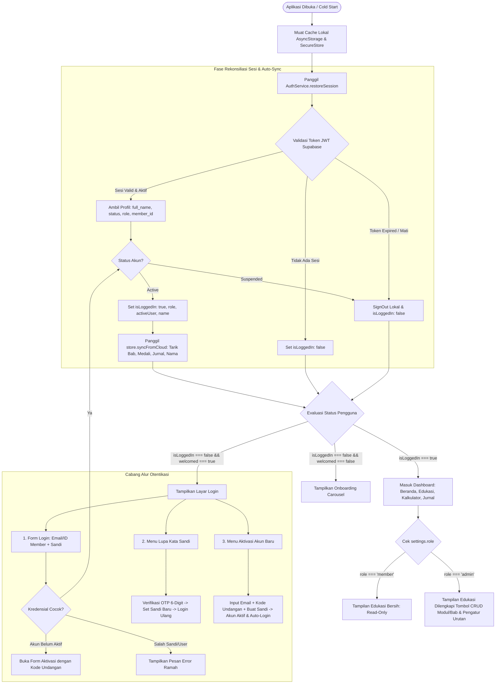
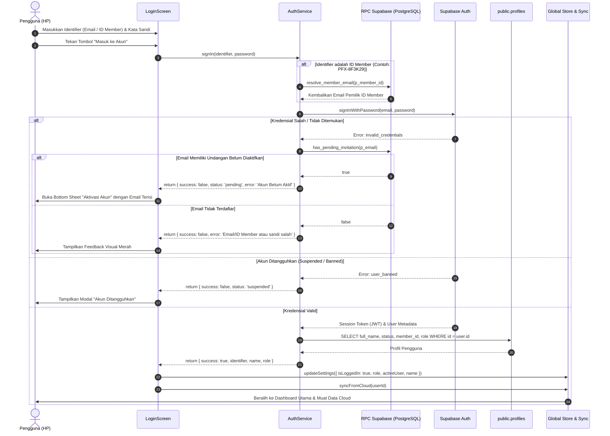
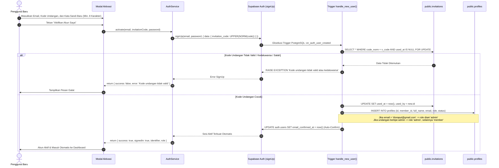
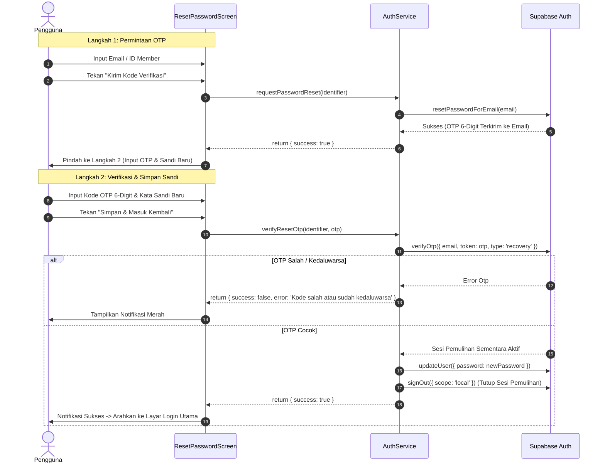
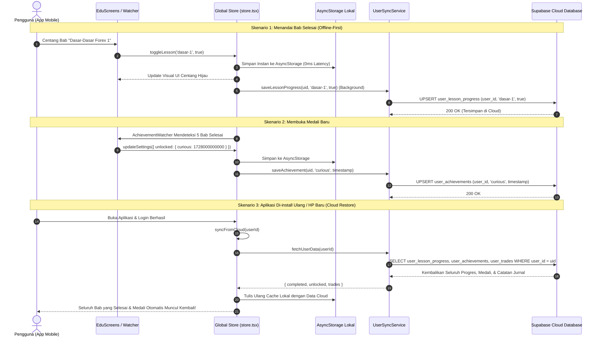

# Spesifikasi Lengkap & Menyeluruh: Arsitektur Autentikasi, Hak Akses (RBAC), Manajemen Konten Edukasi, dan Sinkronisasi Cloud PALTI FX

## Status Dokumen
- **Status**: Disepakati, Tuntas Diimplementasikan & Siap Produksi (*Complete Architectural Blueprint, Security Specification, & Implementation Manual*).
- **Cakupan Dokumen**: 
  1. Filosofi Keamanan & Ekosistem Tertutup (*Zero Public Signup*).
  2. Alur Lengkap Autentikasi Pengguna (Login, Aktivasi Akun Berbasis Undangan VIP, Pemulihan Sandi OTP 6-Digit, Pemulihan Sesi Otomatis, dan Logout Bersih Multi-Akun).
  3. Matriks Hak Akses Granular (Role-Based Access Control / RBAC) untuk Akun Admin (`dioraput@gmail.com`) vs Akun Member (`diorahmanputra@gmail.com`).
  4. Manajemen Modul & Bab Edukasi Berbasis Mobile (CRUD Lengkap, Tombol Urutan `[⬆️]` `[⬇️]`, Multi-Video YouTube Dinamis, Speed Toolbar Template, serta Pop-up Konfirmasi Keamanan Form).
  5. Arsitektur Cloud Persistence & Sinkronisasi 2-Arah (Menyimpan Progres Bab, Medali Pencapaian, Jurnal Trading, dan Nama Panggilan ke Database Supabase agar data tidak hilang saat aplikasi di-uninstall / ganti perangkat).
  6. Skrip Master Skema Database Supabase Lengkap (Tabel, Triggers, Functions, RLS, Seed Materi, & Seed Undangan VIP).
  7. Matriks Penanganan Galat (*Error Handling*) & Protokol Keamanan.
- **Platform**: Expo SDK 57 (React Native 0.86, React 19, TypeScript), Supabase Cloud Backend (PostgreSQL 15+, Supabase Auth JS v2), `@react-native-async-storage/async-storage`, `expo-secure-store`, `react-native-webview`.

---

## 1. Filosofi & Arsitektur Ekosistem Tertutup (*Invitation-Only*)

PALTI FX dibangun dengan filosofi **Private Trading Community**:
1. **Tidak Ada Pendaftaran Publik Mandiri (*Zero Public Registration*)**: Siapapun yang mengunduh aplikasi tidak dapat mendaftar tanpa memiliki **Kode Undangan Aktif** yang diterbitkan secara resmi oleh Admin melalui database.
2. **Dual Identifier Model**: Pengguna dapat masuk ke akun menggunakan **Alamat Email** atau **ID Member Unik** (berformat acak `PFX-XXXXXXXX`).
3. **Pemisahan Peran yang Tegas (RBAC)**:
   - **Akun Member** (`role: 'member'`): Berfokus pada konsumsi materi kurikulum trading, pencatatan jurnal transaksi, kalkulator risiko, dan pencapaian medali.
     - *Akun Testing Resmi Member*: `diorahmanputra@gmail.com`
   - **Akun Admin** (`role: 'admin'`): Memiliki seluruh kemampuan member ditambah hak istimewa untuk mengelola kurikulum edukasi langsung dari HP (tambah/edit/hapus modul, atur urutan bab, sematkan video YouTube, dsb).
     - *Akun Testing Resmi Admin*: `dioraput@gmail.com`
4. **Ketahanan Data Mutlak (Anti-Hilang Data)**:
   - Seluruh data personal pengguna (nama panggilan, progres bab selesai, medali pencapaian yang terbuka, dan catatan transaksi jurnal) disimpan di database cloud Supabase yang terisolasi per akun (`user_id`).
   - Jika pengguna mengganti HP atau menghapus aplikasi lalu menginstalnya kembali, seluruh riwayat belajar dan transaksi akan otomatis ditarik kembali dari database cloud.

---

## 2. Diagram Arsitektur Autentikasi & State Machine Global



---

## 3. Rincian Alur Autentikasi Pengguna (Step-by-Step)

### 3.1 Alur 1: Masuk Akun (*Sign In Flow*)

Alur masuk mendukung dua jenis pengenal (Email atau ID Member).



#### Komponen Teknis Alur Login:
1. **Normalisasi String:** Identifier di-trim dan diubah menjadi huruf kecil (atau format kode member bersih tanpa spasi).
2. **Resolusi ID Member:** Dijalankan secara aman via fungsi PostgreSQL `resolve_member_email` (`security definer`), mencegah kebocoran daftar email member lain.
3. **Pencegahan Akun Terbengkalai:** Jika pengguna sudah diundang oleh admin tetapi mencoba login langsung tanpa aktivasi, sistem mendeteksinya melalui `has_pending_invitation` dan mengarahkannya ke form pembuatan kata sandi pertama kali.

---

### 3.2 Alur 2: Aktivasi Akun Pertama Kali (*Account Activation Flow*)

Digunakan oleh member baru yang menerima kode undangan dari admin (termasuk kode VIP pengujian).



#### Keunggulan Sistem Aktivasi Ini:
- **Atomik & Bebas Race-Condition:** Validasi kode undangan menggunakan klausa `FOR UPDATE` di level basis data, sehingga satu kode undangan mustahil diklaim oleh dua pengguna secara bersamaan.
- **Tanpa Konfirmasi Email Manual:** Karena undangan hanya diberikan oleh admin terpercaya, pengguna tidak perlu repot membuka inbox email untuk mengklik tautan konfirmasi. Akun langsung aktif saat itu juga (`email_confirmed_at` diisi otomatis).
- **Pembuatan ID Member Otomatis:** Trigger otomatis meng-generate ID Member acak yang unik (contoh: `PFX-8A9F1B2C`) agar tidak berurutan dan tidak bisa ditebak pihak ketiga.

---

### 3.3 Alur 3: Pemulihan Kata Sandi (*Password Reset via 6-Digit OTP*)

Menggunakan metode OTP berbasis email yang ramah ponsel (tanpa deep-link email yang sering gagal di browser HP).



---

### 3.4 Alur 4: Pemulihan Sesi Saat Cold Start & Sinkronisasi Cloud

Menjamin saat pengguna menutup dan membuka kembali aplikasi, mereka tidak perlu login ulang dan seluruh data selalu mutakhir.

1. **Bootstrapping Aplikasi (`App.tsx`):**
   - Aplikasi memuat cache lokal awal dari `AsyncStorage` (data `trades`, `completed`, dan `settings`).
   - `AuthService.restoreSession()` memeriksa keabsahan token JWT yang tersimpan di perangkat.
2. **Pengecekan Integritas Server:**
   - Supabase memverifikasi status user ke server (`supabase.auth.getUser()`). Jika akun ditangguhkan (*banned*) atau dihapus di database, sesi lokal seketika dimusnahkan.
3. **Penyelarasan Nama & Role:**
   - Kolom `role` dan `full_name` dari tabel `public.profiles` diperbarui ke `store.settings`.
4. **Pemicuan Sinkronisasi Cloud (`store.syncFromCloud()`):**
   - Menarik semua entri bab edukasi yang telah diselesaikan (`user_lesson_progress`).
   - Menarik semua medali pencapaian yang telah diraih (`user_achievements`).
   - Menarik seluruh riwayat transaksi jurnal (`user_trades`).
   - Menggabungkan data cloud dengan memori HP secara mulus tanpa membuat UI *flicker*.

---

### 3.5 Alur 5: Logout Bersih & Isolasi Data Multi-Akun

Mencegah kebocoran data jika satu smartphone digunakan bergantian oleh dua pengguna berbeda.

Saat fungsi `store.logout()` dipanggil:
1. `supabase.auth.signOut({ scope: 'local' })` dieksekusi untuk mematikan sesi autentikasi Supabase di perangkat.
2. Memori state lokal dikosongkan total:
   - `setTrades([])` dan hapus kunci storage `@palti_trades`.
   - `setCompleted({})` dan hapus kunci storage `@palti_completed`.
   - `setSettings({ isLoggedIn: false, role: undefined, name: undefined, activeUser: undefined, unlocked: {} })`.
3. Ketika pengguna berikutnya login di perangkat yang sama, mereka akan menerima kanvas bersih yang hanya memuat data milik akun mereka sendiri yang ditarik dari database cloud.

---

## 4. Arsitektur Cloud Persistence: Perubahan Basis Data Progres Kelas, Pencapaian, & Jurnal

### 4.1 Latar Belakang & Urgensi Perubahan Basis Data

Sebelum pembaruan arsitektur ini, seluruh data aktivitas pengguna disimpan secara terisolasi di memori lokal ponsel:
1. **Progres Bab Edukasi (`completed: Record<string, boolean>`)**: Disimpan hanya pada kunci `@palti_completed` di `AsyncStorage`.
2. **Pencapaian Medali (`unlocked: Record<string, number>`)**: Disimpan hanya di dalam objek `@palti_settings.unlocked` di `AsyncStorage`.
3. **Nama Panggilan (*Nickname*)**: Hanya tersimpan di `SecureStore` lokal ponsel.
4. **Jurnal Transaksi Trading (`trades: Trade[]`)**: Disimpan di `@palti_trades` di `AsyncStorage`.

#### Masalah Utama (*The "Wasalaam" Problem*):
- **Data Hangus Saat Hapus Aplikasi:** Jika aplikasi di-uninstall, ponsel di-reset pabrik, atau cache aplikasi dibersihkan, seluruh centang bab belajar dan medali pencapaian yang telah diraih lenyap seketika tanpa bisa dipulihkan (*"kalau di lokal tuh kalau ke hapus aplikasinya yaa wasalaam"*).
- **Tidak Ada Sinkronisasi Multi-Perangkat:** Pengguna yang berganti smartphone atau menggunakan tablet tidak dapat melanjutkan progres belajar dan jurnal yang sudah dibuat di perangkat sebelumnya.
- **Rentan Manipulasi Lokal:** Penyimpanan lokal tidak memiliki validasi integritas data dari sisi server.

#### Solusi Arsitektur Baru:
Dibuat **lemari data relasional terpusat di Supabase** yang mengaitkan setiap entri progres kelas, medali pencapaian, nama panggilan, dan jurnal transaksi secara langsung ke **ID Akun Pengguna (`auth.users.id` / `profiles.id`)**, dipagari oleh **Row Level Security (RLS)** sehingga privasi tiap pengguna terjamin 100%.

```
┌────────────────────────────────────────────────────────────────────────┐
│               SUPABASE AUTHENTICATION (auth.users)                     │
│               id: UUID (Primary Key Pengguna Terotentikasi)            │
└───────────────────────────────────┬────────────────────────────────────┘
                                    │
       ┌────────────────────────────┼────────────────────────────┐
       ▼                            ▼                            ▼
┌────────────────────────┐  ┌────────────────────────┐  ┌────────────────────────┐
│  user_lesson_progress  │  │   user_achievements    │  │      user_trades       │
├────────────────────────┤  ├────────────────────────┤  ├────────────────────────┤
│ user_id: UUID (FK)     │  │ user_id: UUID (FK)     │  │ id: TEXT (PK)          │
│ lesson_id: TEXT        │  │ achievement_id: TEXT   │  │ user_id: UUID (FK)     │
│ completed: BOOLEAN     │  │ unlocked_at: TIMESTAMPTZ│ │ date, symbol, dir, pl  │
│ completed_at: TIMESTAMPTZ │ PK: (user_id,          │  │ lot, entry, exit, sl, tp│
│ PK: (user_id,          │  │      achievement_id)   │  │ created_at: TIMESTAMPTZ│
│      lesson_id)        │  └────────────────────────┘  └────────────────────────┘
└────────────────────────┘               │
       ▲                                 ▼
       │                    ┌────────────────────────┐
       │                    │    public.profiles     │
       │                    ├────────────────────────┤
       │                    │ id: UUID (PK, FK Auth) │
       │                    │ full_name: TEXT (Sync) │
       │                    │ role, status, member_id│
       │                    └────────────────────────┘
```

---

### 4.2 Perubahan Skema 1: Progres Bab Edukasi (`public.user_lesson_progress`)

Tabel ini menyimpan status setiap bab edukasi yang telah ditandai selesai (*completed*) oleh pengguna.

#### 1. Definisi Struktur DDL SQL
```sql
create table if not exists public.user_lesson_progress (
  user_id       uuid not null references auth.users (id) on delete cascade,
  lesson_id     text not null,
  completed     boolean not null default true,
  completed_at  timestamptz not null default now(),
  primary key (user_id, lesson_id)
);
```

#### 2. Bedah Kolom & Desain Arsitektur:
- **`user_id` (UUID, Foreign Key)**: Terikat langsung ke `auth.users(id)`. Klausa `ON DELETE CASCADE` menjamin jika akun pengguna dihapus dari sistem, seluruh progres belajarnya otomatis dibersihkan tanpa meninggalkan *data yatim* (*orphan data*).
- **`lesson_id` (TEXT)**: Menyimpan ID unik bab dari tabel kurikulum `edu_lessons` (contoh: `'dasar-1'`, `'dasar-2'`, `'teknikal-1'`, `'risiko-2'`).
- **`completed` (BOOLEAN)**: Menyatakan status kelulusan bab (default: `true`).
- **`completed_at` (TIMESTAMPTZ)**: Mencatat waktu pasti kapan bab tersebut diselesaikan untuk keperluan analitik streak belajar.
- **Composite Primary Key `(user_id, lesson_id)`**:
  - Mencegah duplikasi data: satu pengguna hanya memiliki 1 catatan per bab.
  - Memungkinkan operasi `UPSERT` yang sangat efisien dan idempotent.

#### 3. Logika Query Operasional (Service Level):
- **Saat Bab Dicentang Selesai:**
  ```sql
  insert into public.user_lesson_progress (user_id, lesson_id, completed, completed_at)
  values ($1, $2, true, now())
  on conflict (user_id, lesson_id) do update
    set completed = true, completed_at = now();
  ```
- **Saat Centang Bab Dibatalkan:**
  ```sql
  delete from public.user_lesson_progress
   where user_id = $1 and lesson_id = $2;
  ```
- **Saat Mengambil Progres Akun saat Login:**
  ```sql
  select lesson_id, completed
    from public.user_lesson_progress
   where user_id = $1 and completed = true;
  ```

---

### 4.3 Perubahan Skema 2: Pencapaian & Medali (`public.user_achievements`)

Tabel ini mengabadikan seluruh medali penghargaan trading dan belajar yang telah dibuka oleh pengguna.

#### 1. Definisi Struktur DDL SQL
```sql
create table if not exists public.user_achievements (
  user_id         uuid not null references auth.users (id) on delete cascade,
  achievement_id  text not null,
  unlocked_at     timestamptz not null default now(),
  primary key (user_id, achievement_id)
);
```

#### 2. Bedah Kolom & Desain Arsitektur:
- **`user_id` (UUID, Foreign Key)**: Mengunci kepemilikan medali ke ID akun pemilik.
- **`achievement_id` (TEXT)**: Kode pengenal medali sesuai sistem evaluasi di `frontend/src/lib/achievements.ts`.
- **`unlocked_at` (TIMESTAMPTZ)**: Timestamp persis kapan medali tersebut diraih pengguna.
- **Composite Primary Key `(user_id, achievement_id)`**: Menjamin sebuah medali tidak dapat dibuka ganda atau diduplikasi.

#### 3. Daftar Medali Sistem yang Tersinkronisasi ke Cloud:
| Achievement ID | Gelar Medali | Tier | Kriteria Terbuka |
| :--- | :--- | :---: | :--- |
| `'welcome'` | **Inner Circle** | Gold | Menyelesaikan onboarding dan resmi menjadi member aktif. |
| `'first_lesson'` | **Langkah Pertama** | Bronze | Menyelesaikan minimal 1 bab materi edukasi. |
| `'curious'` | **Haus Ilmu** | Bronze | Menyelesaikan minimal 5 bab materi edukasi. |
| `'knowledge_seeker'`| **Kutu Buku** | Silver | Menyelesaikan 1 modul edukasi penuh. |
| `'graduate'` | **Lulusan Terbaik** | Gold | Menyelesaikan seluruh kurikulum modul edukasi PALTI FX. |
| `'first_trade'` | **Eksekusi Perdana** | Bronze | Mencatat trade pertama ke dalam jurnal. |
| `'disciplined'` | **Trader Disiplin** | Silver | Mencatat minimal 10 transaksi trade beruntun. |
| `'streak_3'` | **Konsistensi 3 Hari**| Bronze | Mencatat jurnal 3 hari trading berturut-turut. |
| `'streak_7'` | **Master Habit 7 Hari**| Gold | Mencatat jurnal 7 hari trading berturut-turut. |
| `'lot_master'` | **Kalkulasi Cermat** | Bronze | Menggunakan kalkulator lot & risiko minimal 3 kali. |

#### 4. Logika Query Operasional (Service Level):
```sql
insert into public.user_achievements (user_id, achievement_id, unlocked_at)
values ($1, $2, $3)
on conflict (user_id, achievement_id) do nothing;
```

---

### 4.4 Perubahan Skema 3: Jurnal Trading & Penyelarasan Nama Profil

Selain bab dan pencapaian, dua entitas data berikut juga terintegrasi penuh:

#### 1. Jurnal Trading Cloud (`public.user_trades`):
```sql
create table if not exists public.user_trades (
  id          text primary key,
  user_id     uuid not null references auth.users (id) on delete cascade,
  date        text not null, -- YYYY-MM-DD
  symbol      text not null,
  direction   text not null check (direction in ('BUY', 'SELL')),
  lot         numeric not null default 0.01,
  entry       numeric,
  exit        numeric,
  sl          numeric,
  tp          numeric,
  pl          numeric not null default 0,
  pips        numeric,
  setup       text,
  emotion     text,
  notes       text,
  created_at  timestamptz not null default now()
);
```

#### 2. Penyelarasan Nama Panggilan (*Nickname Sync*):
Ketika pengguna mengganti nama panggilannya melalui form profil di Beranda, nama tersebut tidak hanya disimpan di SecureStore ponsel, melainkan langsung diselaraskan ke database cloud Supabase:
```sql
update public.profiles
   set full_name = $2
 where id = $1;
```
Ketika pengguna login di ponsel lain atau setelah install ulang aplikasi, kolom `full_name` dari `profiles` ditarik dan disetel otomatis sebagai nama sapaan di dashboard Beranda.

---

### 4.5 Kebijakan Keamanan Row Level Security (RLS)

Untuk menjamin bahwa data progres belajar, medali penghargaan, dan catatan jurnal trading **tidak dapat diintip atau dimodifikasi oleh akun lain**, setiap tabel dipasangi RLS ketat berbasis token JWT Supabase:

```sql
-- 1. Aktifkan RLS
alter table public.user_lesson_progress enable row level security;
alter table public.user_achievements    enable row level security;
alter table public.user_trades          enable row level security;

-- 2. Kebijakan Isolasi Progres Bab: Hanya Pemilik Akun
create policy "user_lesson_progress_own" on public.user_lesson_progress
  for all to authenticated
  using ((select auth.uid()) = user_id)
  with check ((select auth.uid()) = user_id);

-- 3. Kebijakan Isolasi Medali Pencapaian: Hanya Pemilik Akun
create policy "user_achievements_own" on public.user_achievements
  for all to authenticated
  using ((select auth.uid()) = user_id)
  with check ((select auth.uid()) = user_id);

-- 4. Kebijakan Isolasi Jurnal Transaksi: Hanya Pemilik Akun
create policy "user_trades_own" on public.user_trades
  for all to authenticated
  using ((select auth.uid()) = user_id)
  with check ((select auth.uid()) = user_id);

-- 5. Berikan Hak Akses ke Role Authenticated
grant all on public.user_lesson_progress to authenticated;
grant all on public.user_achievements    to authenticated;
grant all on public.user_trades          to authenticated;
```

> **Keamanan Berlapis:** Klausa `(select auth.uid()) = user_id` dievaluasi di kernel PostgreSQL untuk setiap operasi `SELECT`, `INSERT`, `UPDATE`, maupun `DELETE`. Siapapun yang berusaha mengakses endpoint REST API Supabase tanpa token JWT yang valid atau menggunakan token milik orang lain akan ditolak seketika (*HTTP 403 Forbidden* / data kosong).

---

### 4.6 Implementasi Frontend: Layanan Sinkronisasi & Auto-Sync 2-Arah

Integrasi arsitektur cloud ini diwujudkan melalui modul [`UserSyncService`](file:///c:/Work/palti-fx/palti-fx/frontend/src/lib/userSyncService.ts) dan diikat ke *global reactive store* di [`store.tsx`](file:///c:/Work/palti-fx/palti-fx/frontend/src/lib/store.tsx):



#### Penjelasan Teknis Sinkronisasi 2-Arah (`store.syncFromCloud`):
1. **Penyelarasan Unduh (*Cloud to Local*):**
   Saat user login di HP baru, `cloud.completed` dan `cloud.unlocked` ditarik dan dimasukkan ke dalam state React dan `AsyncStorage`.
2. **Penyelarasan Unggah Data Offline (*Local to Cloud Catch-Up*):**
   Jika pengguna menandai bab selesai atau meraih medali saat tidak ada sinyal internet, data tersimpan di `AsyncStorage`. Begitu aplikasi mendeteksi koneksi dan memanggil `syncFromCloud()`, sistem membandingkan data lokal dengan data cloud:
   ```ts
   // Unggah progres lokal yang belum tercatat di cloud
   Object.entries(prev).forEach(([lId, done]) => {
     if (done && !cloud.completed[lId]) {
       UserSyncService.saveLessonProgress(uid, lId, true);
     }
   });
   ```
3. **Pembersihan Bersih Saat Logout (*Multi-User Sanitization*):**
   Saat pengguna menekan tombol **Keluar (Logout)** di menu Beranda:
   ```ts
   setTrades([]);
   setCompleted({});
   AsyncStorage.removeItem(KEYS.trades);
   AsyncStorage.removeItem(KEYS.completed);
   setSettings({ isLoggedIn: false, role: undefined, name: undefined, activeUser: undefined, unlocked: {} });
   ```
   Langkah ini menjamin bahwa jika pengguna lain login di ponsel yang sama, ia tidak akan melihat sisa progres bab atau medali dari pengguna sebelumnya. Data baru miliknya akan ditarik secara murni dari database cloud miliknya sendiri.

---

## 5. Hak Akses (RBAC) & Manajemen Modul Edukasi

### 5.1 Matriks Perbandingan Fitur: Admin vs Member

| Fitur / Layar | Member (`diorahmanputra@gmail.com`) | Admin (`dioraput@gmail.com`) |
| :--- | :---: | :---: |
| **Membaca Modul & Bab** | ✅ Lengkap | ✅ Lengkap |
| **Menonton Video YouTube yang Disematkan** | ✅ Pemutar responsif di dalam aplikasi | ✅ Pemutar responsif + kelola daftar video |
| **Menandai Bab Selesai (*Progress Bar*)** | ✅ Tersimpan ke cloud | ✅ Tersimpan ke cloud |
| **Tambah Modul Edukasi Baru** | ❌ Disembunyikan total | ✅ Tombol `[+ Tambah Modul]` di Header |
| **Edit Info Modul (Judul, Subjudul, Level, Ikon)** | ❌ Disembunyikan total | ✅ Ikon Pensil `[✏️]` pada Modul |
| **Hapus Modul Bersama Seluruh Babnya** | ❌ Disembunyikan total | ✅ Ikon Tong Sampah `[🗑️]` dengan Dialog Konfirmasi |
| **Tambah Bab Baru ke Dalam Modul** | ❌ Disembunyikan total | ✅ Tombol `[+ Tambah Bab]` di Layar Modul |
| **Edit Isi Bab, Menit, & Materi Markdown** | ❌ Disembunyikan total | ✅ Ikon Pensil `[✏️]` pada Tiap Bab |
| **Ubah Urutan Bab / Modul** | ❌ Tampil sesuai urutan kurikulum | ✅ Tombol Panah `[⬆️]` dan `[⬇️]` Satu Sentuhan |
| **Sematkan Multi-Video YouTube Dinamis** | ❌ Hanya menonton video yang ada | ✅ Form Tambah/Hapus Dinamis (0 s/d Banyak Video) |
| **Speed Toolbar Template Cepat** | ❌ Tidak ada | ✅ Sisipkan `[+ Subjudul]`, `[+ Tips Box]`, `[+ Poin]` |
| **Dialog Konfirmasi Perubahan Belum Disimpan** | ❌ Tidak ada form | ✅ Muncul jika admin menekan batal saat data belum tersimpan |

---

### 5.2 Spesifikasi Teknis YouTube Multi-Video Embeds

Setiap bab edukasi di tabel `public.edu_lessons` memiliki kolom:
```sql
youtube_urls text[] not null default '{}'
```

#### Karakteristik:
1. **Fleksibel & Opsional:** Admin bebas menyematkan:
   - **0 video:** Untuk bab bacaan murni atau teori ringkas.
   - **1 video:** Video penjelasan materi utama.
   - **Banyak video:** Beberapa video demonstrasi analisa chart, contoh eksekusi live trade, atau studi kasus.
2. **Universal URL Parser (Dukungan Segala Tipe Tautan YouTube):**
   Aplikasi dilengkapi fungsi regex parser tangguh yang mengenali berbagai format link YouTube:
   - Format Standar Desktop: `https://www.youtube.com/watch?v=VIDEO_ID`
   - Format Berbagi Pendek: `https://youtu.be/VIDEO_ID`
   - Format YouTube Shorts: `https://www.youtube.com/shorts/VIDEO_ID`
   - Format Embed: `https://www.youtube.com/embed/VIDEO_ID`
   - Tautan dengan Parameter Tambahan (misal: `&t=120s` atau `?si=...`) otomatis dibersihkan dan diekstrak ID videonya secara akurat.
3. **Komponen Pemutar Multi-Platform ([`YouTubePlayer.tsx`](file:///c:/Work/palti-fx/palti-fx/frontend/src/components/YouTubePlayer.tsx)):**
   - Pada **Android & iOS**: Menggunakan modul native `react-native-webview` dengan konfigurasi `mediaPlaybackRequiresUserAction={false}` dan `allowsInlineMediaPlayback={true}`.
   - Pada **Web Platform**: Menggunakan elemen `<iframe>` responsif 16:9 dengan parameter `modestbranding=1&rel=0`.
   - Jika terdapat lebih dari 1 video pada satu bab, antarmuka menyediakan tab selektor bernomor (*Video 1, Video 2, dst*) dengan animasi transisi yang mulus.

---

### 5.3 Safeguard Keamanan Form Editor Materi Admin ([`EduEditorModals.tsx`](file:///c:/Work/palti-fx/palti-fx/frontend/src/components/EduEditorModals.tsx))

Menulis di layar sentuh ponsel memiliki risiko tinggi tersentuh tombol kembali secara tidak sengaja. Untuk itu diterapkan perlindungan berlapis:

1. **Pendeteksi Perubahan Kotor (*Dirty State Detection*):**
   Aplikasi membandingkan nilai form aktif dengan nilai awal (`hasChanges`).
2. **Modal Konfirmasi Batal (*Unsaved Changes Confirmation*):**
   Jika admin menekan tombol *Tutup*, *Batal*, atau *Back Hardware Android* saat form telah diubah namun belum disimpan, sistem memblokir penutupan layar dan menampilkan dialog:
   ```
   ┌──────────────────────────────────────────────┐
   │          ⚠️ Perubahan Belum Disimpan         │
   │ Ada perubahan materi yang belum disimpan ke  │
   │ database. Yakin ingin keluar dan membuang    │
   │ draf ini?                                    │
   │                                              │
   │  [ Lanjut Mengedit ]    [ Buang & Keluar ]   │
   └──────────────────────────────────────────────┘
   ```
3. **Modal Konfirmasi Hapus (*Delete Safeguard*):**
   Pencegahan salah sentuh tombol hapus (`🗑️`):
   ```
   ┌──────────────────────────────────────────────┐
   │              🗑️ Hapus Materi Ini?            │
   │ Modul/Bab ini beserta seluruh datanya akan   │
   │ dihapus permanen dari server. Tindakan ini   │
   │ tidak dapat dibatalkan!                      │
   │                                              │
   │       [ Batal ]          [ Ya, Hapus ]       │
   └──────────────────────────────────────────────┘
   ```
4. **Pengatur Urutan Praktis (Tanpa Drag-and-Drop yang Rentan Rusak di HP):**
   Setiap bab dan modul memiliki tombol panah `[⬆️]` dan `[⬇️]`. Admin cukup menekan panah tersebut, dan urutan (`sort_order`) otomatis tertukar dan tersimpan ke Supabase secara real-time.

---

## 6. Skrip Master Skema Database Supabase Lengkap

File ini menggabungkan seluruh tabel autentikasi, kurikulum edukasi, progres user, serta penugasan akun testing resmi. Siap disalin dan dijalankan langsung di **Supabase SQL Editor**:

```sql
-- =====================================================================
-- PALTI FX — MASTER DATABASE SCHEMA & SECURITY DEFINITIONS
-- =====================================================================

-- 1. Helper: Normalisasi Kode Undangan
create or replace function public.normalize_invite_code(p_code text)
returns text
language sql
immutable
set search_path = ''
as $$
  select upper(regexp_replace(coalesce(p_code, ''), '[\s-]', '', 'g'))
$$;

-- 2. Helper: Updated At Trigger
create or replace function public.touch_updated_at()
returns trigger
language plpgsql
set search_path = ''
as $$
begin
  new.updated_at := now();
  return new;
end;
$$;

-- 3. Generator ID Member Acak Unik (PFX-XXXXXXXX)
create or replace function public.generate_member_id()
returns text
language plpgsql
volatile
set search_path = ''
as $$
declare
  v_id text;
begin
  loop
    v_id := 'PFX-' || upper(substr(replace(gen_random_uuid()::text, '-', ''), 1, 8));
    exit when not exists (select 1 from public.profiles where member_id = v_id);
  end loop;
  return v_id;
end;
$$;

-- ---------------------------------------------------------------------
-- 4. Tabel Inti: Profiles, Invitations, & App Config
-- ---------------------------------------------------------------------
create table if not exists public.profiles (
  id          uuid primary key references auth.users (id) on delete cascade,
  member_id   text not null unique,
  full_name   text,
  email       text not null,
  role        text not null default 'member' check (role in ('member', 'admin')),
  status      text not null default 'active' check (status in ('active', 'suspended')),
  created_at  timestamptz not null default now(),
  updated_at  timestamptz not null default now()
);

create table if not exists public.invitations (
  id          uuid primary key default gen_random_uuid(),
  code        text not null,
  code_norm   text generated always as (upper(regexp_replace(code, '[\s-]', '', 'g'))) stored,
  email       text,
  full_name   text,
  role        text not null default 'member' check (role in ('member', 'admin')),
  expires_at  timestamptz,
  used_at     timestamptz,
  used_by     uuid references auth.users (id) on delete set null,
  created_at  timestamptz not null default now(),
  constraint invitations_code_min_length check (length(regexp_replace(code, '[\s-]', '', 'g')) >= 4)
);
create unique index if not exists invitations_code_norm_key on public.invitations (code_norm);

create table if not exists public.app_config (
  key        text primary key,
  bool_value boolean not null default false
);
insert into public.app_config (key, bool_value)
values ('allow_manual_signup', false)
on conflict (key) do nothing;

-- ---------------------------------------------------------------------
-- 5. Trigger Pembuatan User Baru & Penegakan Undangan
-- ---------------------------------------------------------------------
create or replace function public.handle_new_user()
returns trigger
language plpgsql
security definer
set search_path = ''
as $$
declare
  v_code   text := public.normalize_invite_code(new.raw_user_meta_data ->> 'invitation_code');
  v_inv    public.invitations%rowtype;
  v_manual boolean := coalesce((select c.bool_value from public.app_config c where c.key = 'allow_manual_signup'), false);
  v_role   text := 'member';
begin
  if v_code <> '' then
    select * into v_inv
      from public.invitations i
     where i.code_norm = v_code
       and i.used_at is null
       and (i.expires_at is null or i.expires_at > now())
     for update;

    if not found then
      raise exception 'Kode undangan tidak valid, sudah digunakan, atau kedaluwarsa' using errcode = 'P0001';
    end if;
    if v_inv.email is not null and lower(btrim(v_inv.email)) <> lower(btrim(new.email)) then
      raise exception 'Email tidak sesuai dengan undangan' using errcode = 'P0001';
    end if;
    v_role := v_inv.role;
  elsif not v_manual then
    raise exception 'Pendaftaran hanya melalui undangan' using errcode = 'P0001';
  end if;

  -- Akun khusus admin yang ditetapkan
  if lower(btrim(new.email)) = 'dioraput@gmail.com' then
    v_role := 'admin';
  end if;

  insert into public.profiles (id, member_id, full_name, email, role, status)
  values (
    new.id,
    public.generate_member_id(),
    coalesce(nullif(btrim(new.raw_user_meta_data ->> 'full_name'), ''), v_inv.full_name, split_part(new.email, '@', 1)),
    lower(btrim(new.email)),
    v_role,
    'active'
  );

  if v_inv.id is not null then
    update public.invitations set used_at = now(), used_by = new.id where id = v_inv.id;
  end if;

  -- Konfirmasi email langsung aktif otomatis
  update auth.users
     set email_confirmed_at = coalesce(email_confirmed_at, now())
   where id = new.id
     and email_confirmed_at is null;

  return new;
end;
$$;

drop trigger if exists on_auth_user_created on auth.users;
create trigger on_auth_user_created
  after insert on auth.users
  for each row execute function public.handle_new_user();

-- ---------------------------------------------------------------------
-- 6. RPC untuk Layar Login
-- ---------------------------------------------------------------------
create or replace function public.resolve_member_email(p_member_id text)
returns text
language sql
stable
security definer
set search_path = ''
as $$
  select p.email
    from public.profiles p
   where p.member_id = upper(btrim(p_member_id))
   limit 1;
$$;

create or replace function public.has_pending_invitation(p_email text)
returns boolean
language sql
stable
security definer
set search_path = ''
as $$
  select exists (
           select 1 from public.invitations i
            where lower(btrim(i.email)) = lower(btrim(p_email))
              and i.used_at is null
              and (i.expires_at is null or i.expires_at > now())
         )
     and not exists (
           select 1 from public.profiles p
            where lower(p.email) = lower(btrim(p_email))
         );
$$;

-- ---------------------------------------------------------------------
-- 7. Tabel Modul & Bab Edukasi (CRUD & YouTube)
-- ---------------------------------------------------------------------
create table if not exists public.edu_modules (
  id          text primary key default ('mod-' || lower(substr(replace(gen_random_uuid()::text, '-', ''), 1, 8))),
  title       text not null,
  subtitle    text not null default '',
  level       text not null default 'Pemula' check (level in ('Pemula', 'Menengah', 'Lanjutan')),
  icon        text not null default 'school-outline',
  sort_order  int not null default 0,
  created_at  timestamptz not null default now(),
  updated_at  timestamptz not null default now()
);

create table if not exists public.edu_lessons (
  id            text primary key default ('les-' || lower(substr(replace(gen_random_uuid()::text, '-', ''), 1, 8))),
  module_id     text not null references public.edu_modules (id) on delete cascade,
  title         text not null,
  minutes       int not null default 5,
  youtube_urls  text[] not null default '{}',
  content       text not null default '',
  sort_order    int not null default 0,
  created_at    timestamptz not null default now(),
  updated_at    timestamptz not null default now()
);

drop trigger if exists edu_modules_touch_updated_at on public.edu_modules;
create trigger edu_modules_touch_updated_at
  before update on public.edu_modules
  for each row execute function public.touch_updated_at();

drop trigger if exists edu_lessons_touch_updated_at on public.edu_lessons;
create trigger edu_lessons_touch_updated_at
  before update on public.edu_lessons
  for each row execute function public.touch_updated_at();

-- ---------------------------------------------------------------------
-- 8. Tabel Data Pengguna Cloud: Progres, Pencapaian, Jurnal
-- ---------------------------------------------------------------------
create table if not exists public.user_lesson_progress (
  user_id       uuid not null references auth.users (id) on delete cascade,
  lesson_id     text not null,
  completed     boolean not null default true,
  completed_at  timestamptz not null default now(),
  primary key (user_id, lesson_id)
);

create table if not exists public.user_achievements (
  user_id         uuid not null references auth.users (id) on delete cascade,
  achievement_id  text not null,
  unlocked_at     timestamptz not null default now(),
  primary key (user_id, achievement_id)
);

create table if not exists public.user_trades (
  id          text primary key,
  user_id     uuid not null references auth.users (id) on delete cascade,
  date        text not null,
  symbol      text not null,
  direction   text not null check (direction in ('BUY', 'SELL')),
  lot         numeric not null default 0.01,
  entry       numeric,
  exit        numeric,
  sl          numeric,
  tp          numeric,
  pl          numeric not null default 0,
  pips        numeric,
  setup       text,
  emotion     text,
  notes       text,
  created_at  timestamptz not null default now()
);

-- ---------------------------------------------------------------------
-- 9. Pengaturan Row Level Security (RLS) Menyeluruh
-- ---------------------------------------------------------------------
alter table public.profiles             enable row level security;
alter table public.invitations          enable row level security;
alter table public.app_config           enable row level security;
alter table public.edu_modules          enable row level security;
alter table public.edu_lessons          enable row level security;
alter table public.user_lesson_progress enable row level security;
alter table public.user_achievements    enable row level security;
alter table public.user_trades          enable row level security;

-- Profiles: Pemilik baca & hanya boleh update nama panggilan
drop policy if exists profiles_select_own on public.profiles;
create policy profiles_select_own on public.profiles
  for select to authenticated using ((select auth.uid()) = id);

drop policy if exists profiles_update_own on public.profiles;
create policy profiles_update_own on public.profiles
  for update to authenticated using ((select auth.uid()) = id) with check ((select auth.uid()) = id);

grant select on public.profiles to authenticated;
grant update (full_name) on public.profiles to authenticated;

-- Edukasi: Semua authenticated user bisa membaca
drop policy if exists "edu_modules_read_policy" on public.edu_modules;
create policy "edu_modules_read_policy" on public.edu_modules for select to anon, authenticated using (true);

drop policy if exists "edu_lessons_read_policy" on public.edu_lessons;
create policy "edu_lessons_read_policy" on public.edu_lessons for select to anon, authenticated using (true);

-- Edukasi: Hanya admin yang boleh kelola (CRUD)
drop policy if exists "edu_modules_admin_policy" on public.edu_modules;
create policy "edu_modules_admin_policy" on public.edu_modules for all to authenticated
  using (exists (select 1 from public.profiles where profiles.id = auth.uid() and profiles.role = 'admin'))
  with check (exists (select 1 from public.profiles where profiles.id = auth.uid() and profiles.role = 'admin'));

drop policy if exists "edu_lessons_admin_policy" on public.edu_lessons;
create policy "edu_lessons_admin_policy" on public.edu_lessons for all to authenticated
  using (exists (select 1 from public.profiles where profiles.id = auth.uid() and profiles.role = 'admin'))
  with check (exists (select 1 from public.profiles where profiles.id = auth.uid() and profiles.role = 'admin'));

grant select on public.edu_modules to anon, authenticated;
grant all on public.edu_modules to authenticated;
grant select on public.edu_lessons to anon, authenticated;
grant all on public.edu_lessons to authenticated;

-- Data Pribadi User: Terisolasi 100% per User ID
drop policy if exists "user_lesson_progress_own" on public.user_lesson_progress;
create policy "user_lesson_progress_own" on public.user_lesson_progress
  for all to authenticated using ((select auth.uid()) = user_id) with check ((select auth.uid()) = user_id);

drop policy if exists "user_achievements_own" on public.user_achievements;
create policy "user_achievements_own" on public.user_achievements
  for all to authenticated using ((select auth.uid()) = user_id) with check ((select auth.uid()) = user_id);

drop policy if exists "user_trades_own" on public.user_trades;
create policy "user_trades_own" on public.user_trades
  for all to authenticated using ((select auth.uid()) = user_id) with check ((select auth.uid()) = user_id);

grant all on public.user_lesson_progress to authenticated;
grant all on public.user_achievements    to authenticated;
grant all on public.user_trades          to authenticated;

-- ---------------------------------------------------------------------
-- 10. Undangan VIP & Penugasan Akun Testing Resmi
-- ---------------------------------------------------------------------
insert into public.invitations (code, email, full_name, role)
values
  ('PFX-ADMIN-VIP', 'dioraput@gmail.com', 'Diora Put (Admin)', 'admin'),
  ('PFX-MEMBER-VIP', 'diorahmanputra@gmail.com', 'Diora Rahman (Member)', 'member')
on conflict (code_norm) do update set
  role = excluded.role,
  email = excluded.email;

update public.profiles
   set role = 'admin'
 where lower(email) = 'dioraput@gmail.com';

update public.profiles
   set role = 'member'
 where lower(email) = 'diorahmanputra@gmail.com';
```

---

## 7. Matriks Penanganan Galat (*Error Handling*) & Keamanan

### 7.1 Pemetaan Error Ramah Pengguna ([`authUtils.ts`](file:///c:/Work/palti-fx/palti-fx/frontend/src/lib/authUtils.ts))
Setiap kode error mentah dari PostgreSQL atau Supabase dipetakan ke pesan bahasa Indonesia yang mudah dipahami:

| Kode Galat Supabase / PostgreSQL | Pesan Ramah Pengguna yang Ditampilkan |
| :--- | :--- |
| `invalid_credentials` | "Email/ID Member atau kata sandi tidak cocok." |
| `user_banned` / `P0002` | "Akun ini ditangguhkan. Silakan hubungi admin PALTI FX." |
| `over_email_send_rate_limit` / `429` | "Terlalu banyak permintaan kirim OTP. Harap tunggu beberapa menit." |
| `P0001` (*Custom Exception Trigger*) | "Kode undangan tidak valid, sudah digunakan, atau kedaluwarsa." |
| `User already registered` | "Email ini sudah terdaftar. Silakan masuk menggunakan kata sandi Anda." |
| `weak_password` | "Kata sandi terlalu lemah. Gunakan minimal 8 karakter." |
| `network_error` / `FetchError` | "Gagal terhubung ke server. Periksa koneksi internet Anda." |

### 7.2 Perlindungan Keamanan Tingkat Tinggi
1. **Proteksi Penetrasi RLS (Row Level Security):** Walaupun seseorang mencoba memanipulasi payload HTTP dari luar aplikasi, PostgreSQL menolak query `INSERT/UPDATE/DELETE` modul edukasi jika `auth.uid()` bukan pemilik role `admin`.
2. **Pencegahan Eksploitasi Hak Akses (*Privilege Escalation*):** Member biasa hanya diberikan hak akses SQL `GRANT UPDATE (full_name) ON public.profiles`. Tidak ada user yang bisa menaikkan status akunnya sendiri menjadi admin melalui REST API.
3. **Isolasi Memori HP:** Kunci enkripsi token disimpan di `SecureStore` (Keychain di iOS / Keystore di Android), dan cache transaksi dibersihkan seketika setiap kali tombol Logout ditekan.

---

## 8. Panduan Verifikasi Pengujian Sistem

1. **Uji Coba Akun Admin (`dioraput@gmail.com`):**
   - Masuk akun -> Masuk tab **Edukasi**.
   - Verifikasi bahwa tombol **`[+ Tambah Modul]`** dan ikon pensil edit muncul.
   - Buat sebuah modul baru dan sebuah bab baru, sematkan 2 link video YouTube berbeda.
   - Tekan tombol keluar tanpa menyimpan form -> Pastikan dialog konfirmasi peringatan muncul.
   - Simpan materi -> Pastikan video YouTube dapat diputar di aplikasi dan tersimpan di database.
   - Tekan tombol panah `[⬆️]` / `[⬇️]` untuk menguji pergeseran urutan materi secara real-time.
2. **Uji Coba Akun Member (`diorahmanputra@gmail.com`):**
   - Masuk akun -> Masuk tab **Edukasi**.
   - Pastikan antarmuka bersih tanpa ada tombol edit, hapus, maupun tambah.
   - Baca materi dan centang selesai pada bab yang baru dibuat oleh admin.
   - Buka tab **Jurnal**, tambahkan 1 catatan trade baru.
   - Lakukan **Logout** -> Masuk kembali ke akun member:
   - Verifikasi bahwa bab yang dicentang selesai, catatan jurnal trade, dan nama panggilan tetap ada dan utuh terisi dari database cloud!
