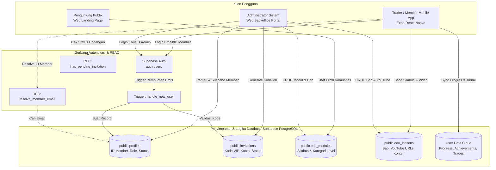
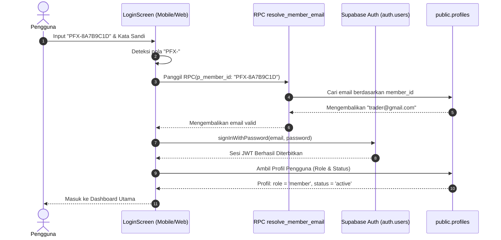
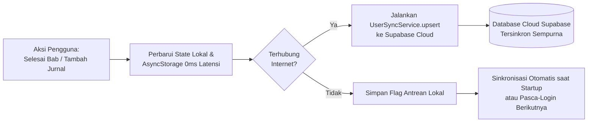
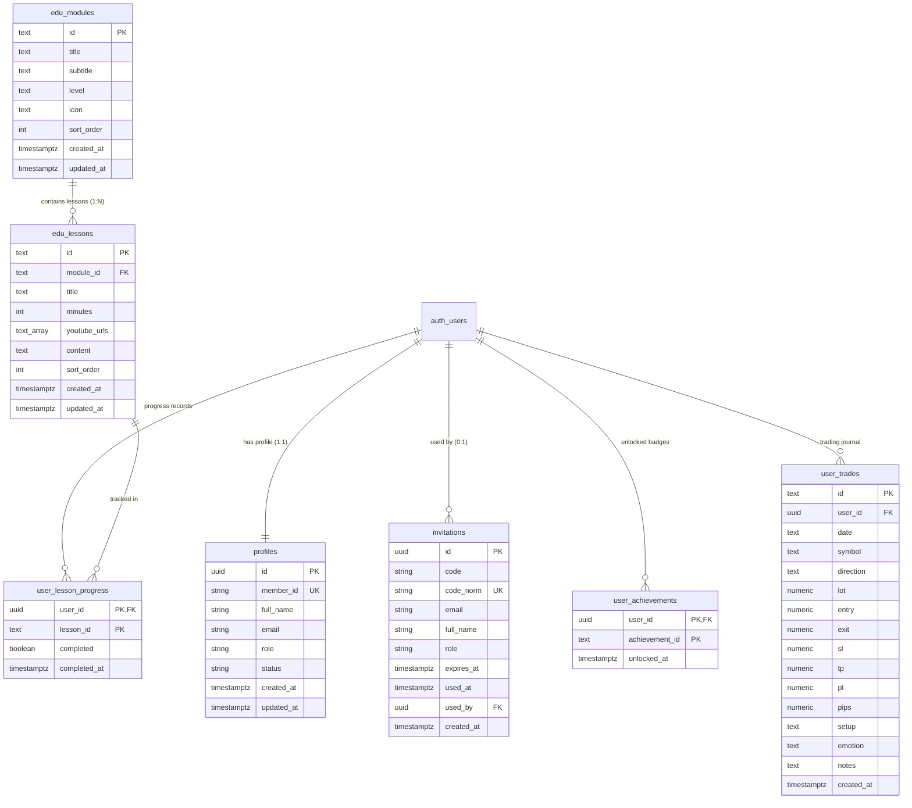

# 📖 DOKUMENTASI LENGKAP SISTEM & ARSITEKTUR — PALTI FX

Dokumen ini adalah **referensi teknis master (Full Version)** untuk ekosistem **PALTI FX**: Private Forex Trading Community, Mobile App, Web Landing Page & Backoffice Admin, serta Database Supabase PostgreSQL.

---

## 📑 DAFTAR ISI

1. [Ringkasan Ekosistem & Filosofi Desain](#1-ringkasan-ekosistem--filosofi-desain)
2. [Peta Arsitektur Monorepo & Aliran Data](#2-peta-arsitektur-monorepo--aliran-data)
3. [Daftar Direktori & Fungsinya ("Buat Apa dan Kemana")](#3-daftar-direktori--fungsinya-buat-apa-dan-kemana)
4. [Sistem Autentikasi, Keamanan & RBAC](#4-sistem-autentikasi-keamanan--rbac)
5. [Kurikulum Edukasi & Multi-Video YouTube](#5-kurikulum-edukasi--multi-video-youtube)
6. [Sistem Kode Undangan VIP & Generator](#6-sistem-kode-undangan-vip--generator)
7. [Direktori Member & Penegakan Keamanan Akun](#7-direktori-member--penegakan-keamanan-akun)
8. [Ketahanan Data Cloud & Pola Offline-First (The "Wasalaam" Rule)](#8-ketahanan-data-cloud--pola-offline-first-the-wasalaam-rule)
9. [Skema Lengkap Database Supabase (DDL & ERD)](#9-skema-lengkap-database-supabase-ddl--erd)
10. [Fungsi Stored Procedure, Triggers, & RPC PostgreSQL](#10-fungsi-stored-procedure-triggers--rpc-postgresql)
11. [Kebijakan Keamanan Tingkat Baris (Row Level Security / RLS)](#11-kebijakan-keamanan-tingkat-baris-row-level-security--rls)
12. [Katalog Query SQL & Supabase JS SDK Operasional](#12-katalog-query-sql--supabase-js-sdk-operasional)
13. [Panduan Operasional & Menjalankan Monorepo (Runbook)](#13-panduan-operasional--menjalankan-monorepo-runbook)

---

## 1. RINGKASAN EKOSISTEM & FILOSOFI DESAIN

**PALTI FX** adalah ekosistem komprehensif edukasi dan komunitas trading forex privat yang terdiri dari:
1. **Mobile Application (`frontend/`)**: Dibangun dengan **React Native / Expo SDK 57 (TypeScript, React 19)**. Dioptimalkan untuk para trader anggota (member) untuk mengakses silabus pembelajaran terstruktur, kalkulator risiko (lot & pips), pencatatan jurnal transaksi harian, serta perolehan medali/streak offline-first.
2. **Web Portal & Backoffice Admin (`web/`)**: Dibangun dengan **React 19 + Vite + TypeScript**. Berisi Landing Page publik modern dan Konsol Backoffice Admin untuk authoring materi kurikulum, penyematan multi-video YouTube, penerbitan kode undangan VIP, dan pemantauan akun trader komunitas.
3. **Database & Auth Cloud (`backend/supabase/`)**: Menggunakan **Supabase PostgreSQL** dengan enkripsi Row Level Security (RLS), *idempotent database triggers*, generator ID unik, dan penegakan suspensi akun otomatis di level engine Auth.

### Prinsip Utama Sistem:
* **Zero Public Registration**: Tidak ada tombol "Daftar Akun Baru" publik tanpa undangan. Semua pendaftaran wajib memiliki kode undangan valid di tabel `public.invitations`.
* **Dual Identifier Login**: Pengguna dapat masuk menggunakan **Email** maupun **ID Member Unik** (`PFX-XXXXXXXX`).
* **Anti-Hilang Data (*The "Wasalaam" Rule*)**: Dilarang hanya menyimpan progres, medali, atau transaksi di storage lokal perangkat. Seluruh data disinkronkan secara mulus (*background upsert*) ke Supabase Cloud via `UserSyncService`.
* **Estetika Ultra-Premium**: Mengusung konsep *Frosted Transparent Glassmorphism*, hairline border, *cahaya rim putih tipis*, dan aksen emas hangat (`#CFA85E`) yang konsisten di platform mobile maupun web.

---

## 2. PETA ARSITEKTUR MONOREPO & ALIRAN DATA

Berikut adalah diagram alir hubungan antara pengguna, aplikasi web, aplikasi mobile, dan Supabase Cloud:



---

## 3. DAFTAR DIREKTORI & FUNGSINYA ("BUAT APA DAN KEMANA")

Setiap direktori dalam monorepo memiliki pembagian tugas yang jelas tanpa redundansi:

```
palti-fx/
├── AGENTS.md                  # Aturan & konvensi baku pengembangan AI Agent
├── package.json               # Root monorepo workspace (workspaces: frontend, backend, web)
│
├── frontend/                  # APLIKASI MOBILE (EXPO SDK 57 / REACT NATIVE)
│   ├── App.tsx                # Entry point mobile, bootstrap auth & sync
│   ├── assets/                # Aset logo PALTI FX (PNG, SVG, Favicon)
│   ├── src/
│   │   ├── components/        # Komponen UI Mobile (Header, GlassCard, Badge, Button)
│   │   ├── screens/           # 6 Layar Utama:
│   │   │   ├── SplashScreen.tsx       # Animasi intro logo
│   │   │   ├── OnboardingScreen.tsx   # Pengenalan fitur komunitas
│   │   │   ├── LoginScreen.tsx        # Login Dual-Identifier (Email / ID Member)
│   │   │   ├── VerifyOTPScreen.tsx    # Verifikasi OTP / Sandi
│   │   │   ├── ResetPasswordScreen.tsx# Pemulihan sandi
│   │   │   ├── ActivationScreen.tsx   # Layar input kode undangan untuk aktivasi
│   │   │   ├── HomeScreen.tsx         # Dashboard trader & ringkasan akun
│   │   │   ├── EducationScreen.tsx    # Silabus kurikulum & player YouTube
│   │   │   ├── JournalScreen.tsx      # Pencatatan transaksi trading (Buy/Sell, Lot, PnL)
│   │   │   ├── CalculatorScreen.tsx   # Kalkulator risiko trading forex
│   │   │   └── ProfileScreen.tsx      # Profil trader, medali, & streak
│   │   ├── lib/
│   │   │   ├── supabase.ts            # Client SDK Supabase mobile
│   │   │   ├── userSyncService.ts     # Layanan sinkronisasi data cloud offline-first
│   │   │   └── notificationService.ts # Layanan push notification & pengingat
│   │   └── types/             # Deklarasi tipe TypeScript untuk mobile
│
├── web/                       # WEB LANDING PAGE & ADMIN BACKOFFICE (REACT 19 + VITE)
│   ├── index.html             # Entry HTML dengan Google Fonts (Outfit & Inter)
│   ├── vite.config.ts         # Konfigurasi bundler Vite & deduplikasi React
│   ├── src/
│   │   ├── App.tsx            # Router path-based (/ , /admin, /admin/materi, dll.)
│   │   ├── index.css          # Desain sistem Vanilla CSS Glassmorphism
│   │   ├── components/
│   │   │   └── admin/
│   │   │       └── AdminSidebar.tsx   # Sidebar admin mandiri (terkunci di kiri)
│   │   ├── pages/
│   │   │   ├── LandingPage.tsx        # Halaman publik showcase mobile app & VIP CTA
│   │   │   └── admin/
│   │   │       ├── AdminLayout.tsx    # Kerangka backoffice (Sidebar + Header Bar)
│   │   │       ├── AdminLogin.tsx     # Login admin landscape persegi panjang
│   │   │       ├── AdminDashboardView.tsx # Tampilan Ringkasan menjorok non-card
│   │   │       ├── AdminMateriView.tsx# CRUD Modul, Bab, & Multi-Video YouTube
│   │   │       ├── AdminInvitationsView.tsx # Generator & pelacak kode undangan VIP
│   │   │       └── AdminUsersView.tsx # Manajemen member & aksi suspend
│   │   ├── lib/
│   │   │   ├── supabase.ts            # Client SDK Supabase web
│   │   │   ├── adminAuth.ts           # Logika auth & proteksi RBAC admin web
│   │   │   ├── adminMateri.ts         # Layanan CRUD silabus & video YouTube
│   │   │   ├── adminInvitations.ts    # Layanan generator kode VIP
│   │   │   └── adminUsers.ts          # Layanan monitoring profil & dashboard stats
│   │   └── types/             # Deklarasi tipe TypeScript data admin web
│
└── backend/                   # SERVER & DATABASE MIGRATION
    ├── supabase/
    │   ├── schema.sql         # Skema master: tabel, trigger, generator ID, dan RLS
    │   └── admin_web_schema.sql # Skema izin RLS tambahan untuk portal Web Admin
    └── src/                   # REST API server (opsional/ekstensi backend Node.js)
```

---

## 4. SISTEM AUTENTIKASI, KEAMANAN & RBAC

Sistem autentikasi PALTI FX dirancang tertutup dengan proteksi ganda:

### A. Alur Dual-Identifier Login (Email atau ID Member)
Pengguna dapat masuk menggunakan **Email** biasa atau **ID Member Unik** (`PFX-XXXXXXXX`):
1. Pengguna menginput identifier pada form login.
2. Jika input diawali dengan `PFX-` (atau cocok dengan pola ID member), aplikasi memanggil RPC PostgreSQL `public.resolve_member_email(p_member_id)`.
3. Database mencari email yang terikat dengan ID tersebut secara *security definer*.
4. Jika ditemukan, aplikasi melanjutkan otentikasi kata sandi ke `supabase.auth.signInWithPassword()` menggunakan email yang ditemukan.



### B. Role-Based Access Control (RBAC)
Terdapat 2 peran (*roles*) dalam sistem:
| Role | Hak Akses | Akses Platform |
| :--- | :--- | :--- |
| `admin` | Full CRUD kurikulum materi & video, generator kode undangan VIP, pengawasan member, suspend akun, melihat statistik ekosistem. | Web Backoffice (`/admin`) & Mobile |
| `member` | Read-only kurikulum materi edukasi, pencatatan jurnal transaksi pribadi, kalkulator risiko trading, unlock medali & streak. | Mobile App & Landing Page |

*Akun Uji Resmi*:
- **Admin**: `dioraput@gmail.com` (Kode: `PFX-ADMIN-VIP`)
- **Member**: `diorahmanputra@gmail.com` (Kode: `PFX-MEMBER-VIP`)

---

## 5. KURIKULUM EDUKASI & MULTI-VIDEO YOUTUBE

Kurikulum diatur dalam relasi hirarkis: **Modul (Parent)** memiliki banyak **Bab / Lesson (Children)**.

### A. Fitur Multi-Video YouTube
* Setiap bab memiliki kolom array `youtube_urls text[]`.
* Mendukung 3 kondisi:
  1. **0 Video**: Materi berbentuk artikel/bacaan teori murni.
  2. **1 Video**: Video utama disematkan di bagian atas bab.
  3. **Multi-Video (>1)**: Ditampilkan dalam bentuk carousel tab selektor (*Video 1, Video 2, Video 3*).
* Didukung oleh parser URL serbaguna yang otomatis mengonversi link standar (`watch?v=`), link pendek (`youtu.be/`), maupun format YouTube Shorts (`shorts/`) ke format embed resmi `https://www.youtube.com/embed/{ID}`.

### B. Pengaman Form Authoring (Admin Safeguards)
* **Dirty Check Detection**: Jika admin mengubah teks atau menambah video lalu menekan tombol batal/kembali tanpa menyimpan, sistem memunculkan dialog peringatan (*Unsaved Changes Alert*).
* **Delete Safeguard**: Operasi penghapusan modul atau bab wajib melalui konfirmasi modal (*"Apakah Anda yakin ingin menghapus materi ini?"*).
* **Sort Ordering**: Pengubahan urutan materi menggunakan tombol panah `[⬆️]` dan `[⬇️]` yang memperbarui nilai kolom `sort_order` secara instan.

---

## 6. SISTEM KODE UNDANGAN VIP & GENERATOR

Pendaftaran akun baru wajib divalidasi oleh tabel `public.invitations`.

### A. Mekanisme Kerja Validasi Pendaftaran
Saat fungsi `supabase.auth.signUp()` dipanggil, metadata kode undangan disertakan:
```typescript
await supabase.auth.signUp({
  email,
  password,
  options: {
    data: {
      invitation_code: 'PFX-VIP-8899',
      full_name: 'Nama Lengkap'
    }
  }
});
```
Trigger database PostgreSQL `handle_new_user()` mengeksekusi validasi:
1. Menormalisasi kode via `normalize_invite_code()` (menghapus spasi dan tanda hubung, mengubah ke huruf kapital).
2. Mengecek apakah kode ada, belum pernah digunakan (`used_at IS NULL`), dan belum kedaluwarsa (`expires_at > now()`).
3. Jika valid:
   - Membuat record di `public.profiles` dengan ID Member unik (`PFX-XXXXXXXX`).
   - Menandai kode undangan sebagai terpakai (`used_at = now()`, `used_by = new.id`).
   - Mengonfirmasi email akun secara otomatis (`email_confirmed_at = now()`).
4. Jika tidak valid: Trigger membatalkan transaksi (`RAISE EXCEPTION`) dan pendaftaran akun ditolak seketika.

---

## 7. DIREKTORI MEMBER & PENEGAKAN KEAMANAN AKUN

Setiap member yang terdaftar memiliki profil di tabel `public.profiles`:

### A. Generator ID Member Unik
Fungsi stored procedure `generate_member_id()` menghasilkan format ID:
$$\text{PFX-} + 8 \text{ karakter acak alfanumerik (contoh: } \text{PFX-7F3A9C12}\text{)}$$
ID ini bersifat acak dan tidak berurutan agar tidak dapat ditebak (*anti-enumeration*).

### B. Penegakan Suspensi Otomatis (*Automatic Ban Enforcement*)
Saat status seorang pengguna diubah dari `'active'` menjadi `'suspended'` oleh admin di Web Backoffice:
* Trigger PostgreSQL `profiles_sync_ban` langsung memperbarui tabel internal Supabase `auth.users`:
  ```sql
  update auth.users
     set banned_until = now() + interval '100 years'
   where id = new.id;
  ```
* Efeknya: Token autentikasi JWT pengguna langsung dibatalkan oleh engine Supabase Auth, sehingga pengguna seketika terlempar keluar (*force logout*) dan tidak dapat login kembali sampai statusnya diaktifkan kembali oleh admin.

---

## 8. KETAHANAN DATA CLOUD & POLA OFFLINE-FIRST (THE "WASALAAM" RULE)

Untuk mencegah kehilangan data berharga trader saat ganti perangkat atau membersihkan cache aplikasi:



### Prosedur Sinkronisasi (`UserSyncService`):
1. **Startup & Login**: Memanggil `syncFromCloud()` untuk mengunduh seluruh progres bab selesai (`user_lesson_progress`), medali (`user_achievements`), dan jurnal trade (`user_trades`) yang ada di cloud.
2. **Saat Menambah Transaksi**: Menyimpan transaksi ke state lokal, lalu melakukan `upsert` ke tabel `public.user_trades`.
3. **Pembersihan Bersih Saat Logout**: Fungsi `logout()` mengosongkan state memori dan menghapus key AsyncStorage lokal (`trades`, `completed_lessons`, `unlocked_achievements`, `user_profile`) untuk mencegah kebocoran data antar-pengguna pada perangkat fisik yang sama.

---

## 9. SKEMA LENGKAP DATABASE SUPABASE (DDL & ERD)

### A. Entity Relationship Diagram (ERD)



### B. Definisi Kolom & Tipe Data Setiap Tabel (DDL SQL)

#### 1. Tabel `public.profiles` (Profil & Akun Member)
Menyimpan data identitas, ID Member, peran, dan status akun yang terikat ke `auth.users`.
```sql
create table if not exists public.profiles (
  id          uuid primary key references auth.users (id) on delete cascade,
  member_id   text not null unique,
  full_name   text,
  email       text not null,
  role        text not null default 'member' check (role in ('member', 'admin')),
  status      text not null default 'active' check (status in ('active', 'suspended')),
  created_at  timestamptz not null default now(),
  updated_at  timestamptz not null default now()
);
```

#### 2. Tabel `public.invitations` (Kode Undangan VIP)
Menyimpan seluruh kuota kode undangan, status aktivasi, dan pembatasan email.
```sql
create table if not exists public.invitations (
  id          uuid primary key default gen_random_uuid(),
  code        text not null,
  code_norm   text generated always as (upper(regexp_replace(code, '[\s-]', '', 'g'))) stored,
  email       text,
  full_name   text,
  role        text not null default 'member' check (role in ('member', 'admin')),
  expires_at  timestamptz,
  used_at     timestamptz,
  used_by     uuid references auth.users (id) on delete set null,
  created_at  timestamptz not null default now(),
  constraint invitations_code_min_length
    check (length(regexp_replace(code, '[\s-]', '', 'g')) >= 6)
);
create unique index if not exists invitations_code_norm_key on public.invitations (code_norm);
```

#### 3. Tabel `public.edu_modules` (Modul Silabus)
Kategori induk materi silabus (contoh: Tingkat Pemula, Analisis Teknikal, dsb.).
```sql
create table if not exists public.edu_modules (
  id          text primary key default ('mod-' || lower(substr(replace(gen_random_uuid()::text, '-', ''), 1, 8))),
  title       text not null,
  subtitle    text not null default '',
  level       text not null default 'Pemula' check (level in ('Pemula', 'Menengah', 'Lanjutan')),
  icon        text not null default 'school-outline',
  sort_order  int not null default 0,
  created_at  timestamptz not null default now(),
  updated_at  timestamptz not null default now()
);
```

#### 4. Tabel `public.edu_lessons` (Bab & Multi-Video YouTube)
Bab materi edukasi yang berisi tautan video dan panduan belajar.
```sql
create table if not exists public.edu_lessons (
  id            text primary key default ('les-' || lower(substr(replace(gen_random_uuid()::text, '-', ''), 1, 8))),
  module_id     text not null references public.edu_modules (id) on delete cascade,
  title         text not null,
  minutes       int not null default 5,
  youtube_urls  text[] not null default '{}',
  content       text not null default '',
  sort_order    int not null default 0,
  created_at    timestamptz not null default now(),
  updated_at    timestamptz not null default now()
);
```

#### 5. Tabel `public.user_lesson_progress` (Progres Belajar Anggota)
Mencatat bab-bab mana saja yang telah diselesaikan oleh setiap member.
```sql
create table if not exists public.user_lesson_progress (
  user_id       uuid not null references auth.users (id) on delete cascade,
  lesson_id     text not null,
  completed     boolean not null default true,
  completed_at  timestamptz not null default now(),
  primary key (user_id, lesson_id)
);
```

#### 6. Tabel `public.user_achievements` (Medali Pencapaian)
Mencatat medali penghargaan trading yang telah dibuka oleh member.
```sql
create table if not exists public.user_achievements (
  user_id         uuid not null references auth.users (id) on delete cascade,
  achievement_id  text not null,
  unlocked_at     timestamptz not null default now(),
  primary key (user_id, achievement_id)
);
```

#### 7. Tabel `public.user_trades` (Jurnal Transaksi Trading)
Buku catatan harian posisi trading member (pair currency, arah, lot, pip, dan profit/loss).
```sql
create table if not exists public.user_trades (
  id          text primary key,
  user_id     uuid not null references auth.users (id) on delete cascade,
  date        text not null,
  symbol      text not null,
  direction   text not null check (direction in ('BUY', 'SELL')),
  lot         numeric not null default 0.01,
  entry       numeric,
  exit        numeric,
  sl          numeric,
  tp          numeric,
  pl          numeric not null default 0,
  pips        numeric,
  setup       text,
  emotion     text,
  notes       text,
  created_at  timestamptz not null default now()
);
```

---

## 10. FUNGSI STORED PROCEDURE, TRIGGERS, & RPC POSTGRESQL

Berikut adalah seluruh fungsi dan prosedur SQL yang berjalan otomatis di Supabase PostgreSQL:

### 1. `normalize_invite_code(p_code text)`
Menghapus spasi dan tanda hubung serta mengonversi kode ke huruf kapital.
```sql
create or replace function public.normalize_invite_code(p_code text)
returns text language sql immutable set search_path = '' as $$
  select upper(regexp_replace(coalesce(p_code, ''), '[\s-]', '', 'g'))
$$;
```

### 2. `generate_member_id()`
Menghasilkan ID unik `PFX-XXXXXXXX` dengan garansi tidak ada duplikasi di database.
```sql
create or replace function public.generate_member_id()
returns text language plpgsql volatile set search_path = '' as $$
declare
  v_id text;
begin
  loop
    v_id := 'PFX-' || upper(substr(replace(gen_random_uuid()::text, '-', ''), 1, 8));
    exit when not exists (select 1 from public.profiles where member_id = v_id);
  end loop;
  return v_id;
end
$$;
```

### 3. `handle_new_user()` (Trigger Otentikasi Utama)
Dijalankan secara otomatis setiap kali ada akun baru dibuat di `auth.users`:
```sql
create or replace function public.handle_new_user()
returns trigger language plpgsql security definer set search_path = '' as $$
declare
  v_code   text := public.normalize_invite_code(new.raw_user_meta_data ->> 'invitation_code');
  v_inv    public.invitations%rowtype;
  v_manual boolean := coalesce((select c.bool_value from public.app_config c where c.key = 'allow_manual_signup'), false);
  v_role   text := 'member';
begin
  if v_code <> '' then
    select * into v_inv
      from public.invitations i
     where i.code_norm = v_code
       and i.used_at is null
       and (i.expires_at is null or i.expires_at > now())
     for update;

    if not found then
      raise exception 'Kode undangan tidak valid, sudah digunakan, atau kedaluwarsa' using errcode = 'P0001';
    end if;
    if v_inv.email is not null and lower(btrim(v_inv.email)) <> lower(btrim(new.email)) then
      raise exception 'Email tidak sesuai dengan undangan' using errcode = 'P0001';
    end if;
    v_role := v_inv.role;
  elsif not v_manual then
    raise exception 'Pendaftaran hanya melalui undangan' using errcode = 'P0001';
  end if;

  if lower(btrim(new.email)) = 'dioraput@gmail.com' then
    v_role := 'admin';
  end if;

  insert into public.profiles (id, member_id, full_name, email, role, status)
  values (
    new.id,
    public.generate_member_id(),
    coalesce(nullif(btrim(new.raw_user_meta_data ->> 'full_name'), ''), v_inv.full_name, split_part(new.email, '@', 1)),
    lower(btrim(new.email)),
    v_role,
    'active'
  );

  if v_inv.id is not null then
    update public.invitations set used_at = now(), used_by = new.id where id = v_inv.id;
  end if;

  update auth.users
     set email_confirmed_at = coalesce(email_confirmed_at, now())
   where id = new.id
     and email_confirmed_at is null;

  return new;
end
$$;
```

### 4. `sync_profile_ban()` (Penegakan Suspensi Otomatis)
Menyelaraskan status profil dengan kolom `banned_until` pada tabel engine Auth:
```sql
create or replace function public.sync_profile_ban()
returns trigger language plpgsql security definer set search_path = '' as $$
begin
  update auth.users
     set banned_until = case when new.status = 'suspended' then now() + interval '100 years' else null end
   where id = new.id;
  return new;
end
$$;
```

### 5. `resolve_member_email(p_member_id text)` (RPC Dual-Identifier)
Mengambil alamat email pengguna berdasarkan ID Member:
```sql
create or replace function public.resolve_member_email(p_member_id text)
returns text language sql stable security definer set search_path = '' as $$
  select p.email
    from public.profiles p
   where p.member_id = upper(btrim(p_member_id))
   limit 1
$$;
```

### 6. `has_pending_invitation(p_email text)` (RPC Deteksi Status Undangan)
Mengecek apakah suatu email memiliki tiket undangan yang belum diaktivasi:
```sql
create or replace function public.has_pending_invitation(p_email text)
returns boolean language sql stable security definer set search_path = '' as $$
  select exists (
           select 1 from public.invitations i
            where lower(btrim(i.email)) = lower(btrim(p_email))
              and i.used_at is null
              and (i.expires_at is null or i.expires_at > now())
         )
     and not exists (
           select 1 from public.profiles p
            where lower(p.email) = lower(btrim(p_email))
         )
$$;
```

### 7. `get_admin_dashboard_stats()` (RPC Statistik Agregat Web Admin)
Mengembalikan data ringkasan KPI ekosistem secara atomik kepada akun admin:
```sql
create or replace function public.get_admin_dashboard_stats()
returns json language plpgsql security definer set search_path = '' as $$
declare
  v_is_admin boolean;
  v_total_users int;
  v_active_users int;
  v_total_modules int;
  v_total_lessons int;
  v_active_invites int;
  v_used_invites int;
begin
  select exists (
    select 1 from public.profiles
    where id = auth.uid() and role = 'admin'
  ) into v_is_admin;

  if not coalesce(v_is_admin, false) then
    raise exception 'Hanya administrator yang dapat melihat statistik dashboard' using errcode = '42501';
  end if;

  select count(*) into v_total_users from public.profiles;
  select count(*) into v_active_users from public.profiles where status = 'active';
  select count(*) into v_total_modules from public.edu_modules;
  select count(*) into v_total_lessons from public.edu_lessons;
  select count(*) into v_active_invites from public.invitations where used_at is null and (expires_at is null or expires_at > now());
  select count(*) into v_used_invites from public.invitations where used_at is not null;

  return json_build_object(
    'total_users', v_total_users,
    'active_users', v_active_users,
    'total_modules', v_total_modules,
    'total_lessons', v_total_lessons,
    'active_invites', v_active_invites,
    'used_invites', v_used_invites
  );
end;
$$;
```

---

## 11. KEBIJAKAN KEAMANAN TINGKAT BARIS (ROW LEVEL SECURITY / RLS)

Semua tabel dilindungi oleh Row Level Security (RLS) PostgreSQL aktif:

| Tabel | Operasi | Role Target | Syarat Kebijakan RLS (USING Expression) |
| :--- | :--- | :--- | :--- |
| `public.profiles` | SELECT | `authenticated` | Pemilik akun (`auth.uid() = id`) ATAU akun dengan `role = 'admin'` |
| `public.profiles` | UPDATE (nama) | `authenticated` | Pemilik akun (`auth.uid() = id`) |
| `public.profiles` | UPDATE (status) | `admin` | Hanya akun admin (`exists (select 1 from profiles where id = auth.uid() and role = 'admin')`) |
| `public.invitations` | ALL | `admin` | Hanya akun admin yang dapat melihat, membuat, mengedit, atau menghapus kode undangan |
| `public.edu_modules` | SELECT | `anon, auth` | Terbuka untuk umum (publik & member) |
| `public.edu_modules` | INSERT/UPDATE/DELETE | `admin` | Hanya akun admin |
| `public.edu_lessons` | SELECT | `anon, auth` | Terbuka untuk umum (publik & member) |
| `public.edu_lessons` | INSERT/UPDATE/DELETE | `admin` | Hanya akun admin |
| `public.user_lesson_progress` | ALL | `authenticated` | Hanya pemilik progres (`auth.uid() = user_id`) |
| `public.user_achievements` | ALL | `authenticated` | Hanya pemilik medali (`auth.uid() = user_id`) |
| `public.user_trades` | ALL | `authenticated` | Hanya pemilik catatan transaksi (`auth.uid() = user_id`) |

---

## 12. KATALOG QUERY SQL & SUPABASE JS SDK OPERASIONAL

Katalog query yang dipakai pada implementasi frontend, web admin, dan backend:

### A. Manajemen Kurikulum Edukasi
```typescript
// 1. Ambil semua modul terurut
const { data: modules } = await supabase
  .from('edu_modules')
  .select('*')
  .order('sort_order', { ascending: true });

// 2. Ambil semua bab dalam suatu modul
const { data: lessons } = await supabase
  .from('edu_lessons')
  .select('*')
  .eq('module_id', moduleId)
  .order('sort_order', { ascending: true });

// 3. Tambah bab baru dengan array video YouTube
const { data: newLesson } = await supabase
  .from('edu_lessons')
  .insert({
    module_id: 'mod-1',
    title: 'Analisis Candlestick & Market Structure',
    minutes: 12,
    youtube_urls: [
      'https://www.youtube.com/watch?v=dQw4w9WgXcQ',
      'https://youtu.be/8ZtInClXe1Q'
    ],
    content: 'Materi lengkap panduan formasi candle...',
    sort_order: 1
  })
  .select()
  .single();
```

### B. Pembuatan Kode Undangan VIP Otomatis / Kustom
```typescript
// Buat kode undangan kustom atau batch
const { data: invite } = await supabase
  .from('invitations')
  .insert({
    code: 'PFX-VIP-GOLD88',
    email: 'calonmember@gmail.com', // opsional (bisa null untuk siapa saja)
    full_name: 'Budi Trader',
    role: 'member',
    expires_at: new Date(Date.now() + 30 * 24 * 60 * 60 * 1000).toISOString() // 30 hari
  })
  .select()
  .single();
```

### C. Sinkronisasi Progres Belajar & Jurnal Transaksi
```typescript
// 1. Tandai bab selesai (Upsert Cloud)
await supabase
  .from('user_lesson_progress')
  .upsert({
    user_id: user.id,
    lesson_id: 'les-candlestick',
    completed: true,
    completed_at: new Date().toISOString()
  });

// 2. Simpan transaksi baru ke jurnal cloud
await supabase
  .from('user_trades')
  .upsert({
    id: 'tr-9921',
    user_id: user.id,
    date: '2026-10-04',
    symbol: 'XAUUSD',
    direction: 'BUY',
    lot: 0.10,
    entry: 2650.50,
    exit: 2665.20,
    pl: 147.0,
    pips: 147,
    setup: 'Breakout H4 Support',
    emotion: 'Tenang'
  });
```

---

## 13. PANDUAN OPERASIONAL & MENJALANKAN MONOREPO (RUNBOOK)

### A. Perintah Standar Pengembangan
Jalankan dari direktori root `palti-fx/`:

```bash
# 1. Menjalankan Aplikasi Mobile (Expo Dev Server)
npm run start:frontend

# 2. Menjalankan Portal Web & Admin Backoffice (Vite)
npm run start:web

# 3. Menjalankan Server Backend API
npm run start:backend

# 4. Validasi Linting & Typecheck (Definition of Done)
npm run lint:frontend
cd frontend && npx tsc --noEmit
npm run build:web
```

### B. Deployment Skema Basis Data ke Supabase
1. Masuk ke **Supabase Dashboard** (`https://supabase.com/dashboard/project/xdeyntmcrdvhspkucclu`).
2. Pilih menu **SQL Editor** pada navigasi kiri.
3. Buat query baru, tempelkan isi file [`backend/supabase/schema.sql`](file:///c:/Work/palti-fx/palti-fx/backend/supabase/schema.sql) dan klik **Run**.
4. Buat query baru kedua, tempelkan isi file [`backend/supabase/admin_web_schema.sql`](file:///c:/Work/palti-fx/palti-fx/backend/supabase/admin_web_schema.sql) dan klik **Run**.

### C. Build Paket APK Android Mandiri (EAS Cloud)
```bash
# Login akun Expo jika belum
npx eas-cli login

# Jalankan build Android profil preview (menghasilkan file .apk siap instal)
npx eas-cli@latest build --profile preview --platform android
```
*(Tutorial lengkap dan tips konfigurasi build lokal tersedia di [`PANDUAN-BUILD-APK.md`](file:///c:/Work/palti-fx/palti-fx/PANDUAN-BUILD-APK.md)).*

---

> **Dokumen Terkait**:
> - 📘 [`AuthFlow.md`](file:///c:/Work/palti-fx/palti-fx/AuthFlow.md) — Arsitektur keamanan dan sinkronisasi mendalam.
> - 📙 [`LoginFlow.md`](file:///c:/Work/palti-fx/palti-fx/LoginFlow.md) — Spesifikasi interaksi 6 layar login mobile.
> - 🤖 [`AGENTS.md`](file:///c:/Work/palti-fx/palti-fx/AGENTS.md) — Aturan baku dan konvensi AI coding monorepo PALTI FX.
