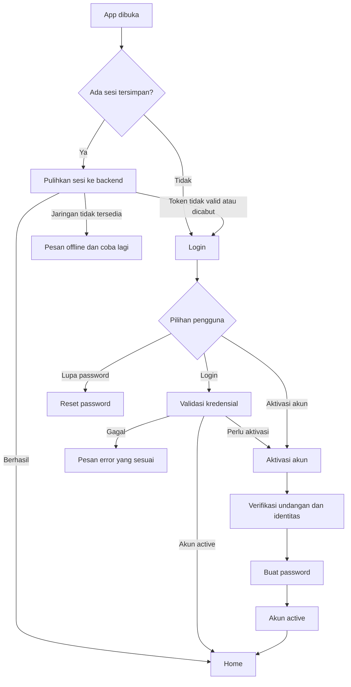

# Login, Aktivasi Akun, dan Sesi

## Status Dokumen

- Status: rancangan untuk didiskusikan; belum diterapkan di aplikasi.
- Tujuan: menyepakati alur autentikasi pengguna PALTI FX sebelum desain layar, backend, atau kode diubah.
- Asumsi utama: akun disiapkan oleh admin sebelum pengguna mengakses aplikasi. Tidak ada pendaftaran publik.
- Usulan awal: akun yang disiapkan admin berstatus `pending_activation`. Pengguna memverifikasi undangan dan membuat password sendiri ketika pertama kali mengaktifkan akun.

## Tujuan dan Batasan

### Tujuan

- Memastikan hanya pengguna yang telah diberi akses oleh admin yang dapat memakai aplikasi.
- Memisahkan aktivasi akun satu kali dari login sehari-hari.
- Mempertahankan sesi dengan aman saat aplikasi ditutup dan dibuka kembali.
- Menangani token kedaluwarsa, koneksi terputus, logout, dan pemulihan akun dengan perilaku yang jelas.

### Bukan Tujuan

- Membuka pembuatan akun mandiri untuk siapa saja.
- Menyimpan password pengguna di perangkat.
- Menentukan desain backend, penyedia email/SMS, masa berlaku token, atau detail implementasi sebelum keputusan produk disepakati.

## Istilah dan Status Akun

- **Akun disiapkan**: identitas pengguna dan hak akses sudah dibuat admin di backend.
- **Pending activation**: akun tersedia, tetapi pemiliknya belum membuktikan akses ke kontak/undangan dan belum menetapkan password.
- **Active**: akun dapat login dan menggunakan aplikasi.
- **Suspended/locked**: akses dibatasi oleh admin atau kebijakan keamanan; pengguna tidak dapat melewati batasan ini melalui aktivasi ulang.
- **Activation code**: kredensial undangan sementara yang terkait dengan satu akun. Kode ini bukan password dan bukan token sesi.
- **Access token**: kredensial berumur pendek untuk memanggil API yang membutuhkan autentikasi.
- **Refresh token**: kredensial yang dipakai untuk meminta access token baru; harus dapat dicabut dan sebaiknya dirotasi saat digunakan.

## Gambaran Alur



## 1. Persiapan Akun oleh Admin

1. Admin membuat akun melalui alat administrasi yang disetujui.
2. Backend menyimpan identitas dan hak akses akun dengan status `pending_activation`.
3. Backend membuat undangan unik yang terikat pada akun tersebut.
4. Admin atau backend mengirim undangan ke kanal yang sudah diverifikasi, atau memberikan kode melalui proses internal yang disepakati.
5. Undangan memiliki masa berlaku, batas percobaan, dan hanya dapat digunakan satu kali.
6. Admin dapat membatalkan atau menerbitkan ulang undangan. Penerbitan ulang membatalkan kode sebelumnya.

Kode undangan tidak boleh menjadi kode umum yang dapat membuat akun baru. Backend harus mengikat kode ke akun yang tepat dan memeriksa status akun saat kode digunakan.

## 2. Pengguna Pertama Kali Membuka Aplikasi

1. Aplikasi menampilkan splash/loading screen sambil memeriksa apakah ada kredensial sesi yang tersimpan.
2. Password tidak pernah disimpan di perangkat. Bila tidak ada sesi yang dapat dipulihkan, tampilkan halaman **Login**.
3. Halaman Login menyediakan:
   - Email atau username.
   - Password.
   - Tampilkan/sembunyikan password.
   - Tombol Login.
   - Tautan Aktivasi akun.
   - Tautan Lupa password.
4. Jangan tampilkan tombol Daftar atau alur pembuatan akun publik.
5. Pengguna yang sudah mengaktifkan akunnya dapat langsung login.
6. Pengguna dengan akun `pending_activation` mengikuti alur aktivasi, bukan membuat identitas baru.

## 3. Aktivasi Akun Undangan

1. Pengguna memilih **Aktivasi akun** dari halaman Login.
2. Pengguna memasukkan kode undangan. Jika produk mengharuskan pencarian akun lewat email/username, backend tetap harus memeriksa bahwa kode dan identitas tersebut cocok.
3. Aplikasi mengirim data aktivasi ke backend melalui koneksi HTTPS. Validitas kode dan status akun diputuskan oleh backend, bukan hanya oleh aplikasi.
4. Jika undangan valid, backend membuktikan kepemilikan kontak yang terdaftar, misalnya melalui OTP email. Kebutuhan OTP dan kanalnya perlu diputuskan sebelum implementasi.
5. Pengguna menetapkan password baru dan mengonfirmasikannya. Aplikasi mengirim password melalui HTTPS untuk diverifikasi/disimpan sebagai hash oleh backend; aplikasi tidak menyimpan password.
6. Backend mengubah status akun menjadi `active`, menandai undangan sudah terpakai, dan mencatat penerimaan syarat/kebijakan yang diperlukan beserta versinya.
7. Usulan pengalaman: setelah aktivasi berhasil, backend menerbitkan sesi dan pengguna masuk ke Home. Jika aturan produk mengharuskan login terpisah, arahkan kembali ke Login dengan pesan sukses.
8. Kode tidak valid, kedaluwarsa, sudah dipakai, dibatalkan, atau terlalu banyak percobaan menghasilkan instruksi pemulihan yang aman. Jangan mengungkap detail akun yang tidak diperlukan.

## 4. Login Sehari-hari

1. Pengguna memasukkan email/username dan password.
2. Aplikasi mengirim permintaan login ke backend melalui HTTPS.
3. Backend memverifikasi password dan status akun.
4. Jika akun `active`, backend menerbitkan access token dan refresh token sesuai kebijakan sesi.
5. Aplikasi menyimpan token menggunakan penyimpanan kredensial aman yang sesuai platform. Jangan menyimpannya sebagai password, jangan menulis token ke log, dan jangan menganggap penyimpanan biasa setara dengan penyimpanan aman.
6. Aplikasi melanjutkan ke Home.
7. Jika akun masih `pending_activation`, arahkan ke aktivasi. Jika akun `suspended/locked`, tampilkan jalur bantuan yang sesuai; jangan menawarkan pembuatan akun baru.

### Kebijakan "Remember Me"

Di aplikasi mobile, sesi persisten biasanya menjadi perilaku default, sehingga checkbox **Remember Me** berpotensi membingungkan. Usulan awal: hilangkan checkbox tersebut dan jelaskan hanya bila diperlukan bahwa pengguna akan tetap login sampai logout atau sesi dicabut. Jika produk membutuhkan pilihan durasi sesi, tentukan konsekuensinya secara eksplisit sebelum menambah kontrol.

## 5. Pembukaan Ulang Aplikasi dan Pemulihan Sesi

Menutup aplikasi tidak sama dengan logout. Saat aplikasi dibuka kembali:

1. Tampilkan splash/loading selama pemeriksaan sesi; hindari menampilkan halaman Login sebentar sebelum mengetahui hasilnya.
2. Jika tidak ada refresh token, arahkan ke Login.
3. Jika ada token, validasi/pulihkan sesi dengan backend. Pemeriksaan waktu kedaluwarsa lokal hanya optimasi, bukan sumber kebenaran.
4. Jika sesi valid, masuk ke Home.
5. Jika access token kedaluwarsa tetapi refresh token valid, minta access token baru lalu lanjutkan ke halaman yang diminta.
6. Jika refresh token kedaluwarsa, dicabut, atau ditolak, hapus kredensial lokal dan arahkan ke Login dengan pesan sesi berakhir.
7. Jika backend tidak dapat dijangkau karena perangkat offline, jangan otomatis menganggap token dicabut atau menghapus sesi. Tampilkan keadaan offline dan tombol Coba lagi. Kebijakan apakah konten tertentu boleh dibuka offline perlu diputuskan terpisah.

## 6. Masa Berlaku dan Refresh Token

- Access token berumur pendek dan dikirim hanya ke API yang membutuhkan autentikasi.
- Refresh token berumur lebih panjang, disimpan di penyimpanan aman, dan hanya digunakan pada endpoint refresh.
- Backend adalah sumber kebenaran untuk validitas, pencabutan, rotasi, dan masa berlaku token.
- Jika refresh gagal karena token invalid/revoked, akhiri sesi lokal. Jika gagal karena jaringan/server, pertahankan sesi lokal dan sediakan retry; jangan menyamakan kegagalan jaringan dengan logout.
- Backend sebaiknya mendeteksi penggunaan ulang refresh token yang sudah dirotasi dan dapat mencabut keluarga sesi terkait.
- Jika refresh dapat terjadi dari beberapa request bersamaan, aplikasi perlu mencegah banyak refresh paralel dan mengulang request yang gagal secara terkendali.

## 7. Lupa dan Reset Password

1. Pengguna memilih **Lupa password** di halaman Login.
2. Pengguna memasukkan email/username yang terdaftar.
3. Backend mengirim instruksi reset ke kontak terverifikasi.
4. Respons awal sebaiknya tidak membocorkan apakah suatu email/username terdaftar.
5. Token/kode reset harus terbatas waktu, sekali pakai, dan terpisah dari activation code.
6. Setelah password diganti, backend menerapkan kebijakan sesi yang dipilih: mempertahankan sesi lain atau mencabutnya.
7. Pengguna mendapat konfirmasi dan mengikuti kebijakan login kembali yang disepakati.

## 8. Logout

1. Pengguna memilih Logout dari Profile/Settings.
2. Tampilkan konfirmasi bila tindakan mudah terpicu tanpa sengaja.
3. Setelah dikonfirmasi, aplikasi meminta backend mencabut refresh token/sesi perangkat bila endpoint tersedia.
4. Aplikasi menghapus access token, refresh token, dan data autentikasi lokal dari penyimpanan aman, termasuk bila permintaan pencabutan gagal.
5. Arahkan ke Login dan tampilkan pesan bahwa pengguna telah logout.
6. Saat aplikasi dibuka kembali, tidak ada sesi lokal sehingga pengguna tetap berada di Login.

Logout pada satu perangkat dan **Logout dari semua perangkat** adalah tindakan berbeda. Jika fitur kedua dibutuhkan, tampilkan sebagai aksi terpisah dan pastikan backend mendukung pencabutan semua sesi.

## 9. Status dan Pesan Error

| Kondisi | Perilaku yang disarankan |
| --- | --- |
| Email/username atau password salah | Pesan umum: kredensial tidak cocok; jangan mengungkap field mana yang valid. Beri kesempatan mencoba lagi dengan rate limit. |
| Akun perlu aktivasi | Arahkan ke Aktivasi akun atau kirim ulang undangan melalui proses yang aman. |
| Undangan invalid/kedaluwarsa/sudah dipakai | Jelaskan langkah berikutnya, misalnya minta undangan baru kepada admin. |
| Akun terkunci/suspended | Tampilkan status yang aman dan cara menghubungi admin/support. |
| Tidak ada internet | Pertahankan input yang aman, tampilkan status offline, dan sediakan Coba lagi. Jangan hapus sesi. |
| Timeout/server error | Tampilkan kegagalan sementara dan retry; jangan menyatakan password salah. |
| Access token kedaluwarsa | Coba refresh secara transparan satu kali sesuai kebijakan. |
| Refresh token invalid/revoked | Hapus sesi lokal dan arahkan ke Login. |
| OTP salah/kedaluwarsa | Beri retry terbatas dan opsi kirim ulang dengan cooldown. |
| Terlalu banyak percobaan | Tampilkan kapan dapat mencoba lagi atau jalur bantuan tanpa membuka detail keamanan internal. |

Pesan error harus singkat, dapat dipahami, tidak menampilkan stack trace/token, dan tidak menghapus input yang tidak sensitif tanpa alasan.

## 10. Prinsip Keamanan

- Password hanya dikirim melalui HTTPS dan diverifikasi di backend menggunakan algoritma hash password yang sesuai. Password tidak disimpan plaintext di backend maupun perangkat.
- Activation code, OTP, reset token, access token, dan refresh token memiliki tujuan berbeda dan tidak boleh saling menggantikan.
- Token rahasia tidak disimpan di log, analytics, URL, atau pesan error.
- Endpoint login, aktivasi, OTP, dan reset password memerlukan rate limiting dan pemantauan percobaan yang wajar.
- Backend memvalidasi status akun dan hak akses pada setiap operasi yang relevan. Menyembunyikan tombol di aplikasi bukan kontrol akses.
- Perubahan status akun oleh admin harus berlaku juga pada sesi yang sudah berjalan sesuai kebijakan pencabutan.
- Persyaratan panjang password, passphrase, reuse, dan pemblokiran password umum harus disepakati bersama backend/product sebelum implementasi.

## 11. Kriteria Penerimaan Rancangan

- Tidak ada pendaftaran publik; akun hanya tersedia setelah disiapkan admin.
- Pengguna dengan akun aktif dapat login tanpa melewati aktivasi.
- Pengguna dengan akun `pending_activation` dapat mengaktifkan akun yang memang diundang, bukan membuat akun baru.
- Penutupan aplikasi tidak otomatis menghapus sesi.
- Sesi valid dipulihkan; token yang dicabut tidak dapat memulihkan sesi.
- Kegagalan jaringan dapat dibedakan dari sesi yang benar-benar tidak valid.
- Logout menghapus kredensial lokal dan mencabut sesi server sesuai kemampuan backend.
- Password tidak disimpan di perangkat dan token tidak dicatat ke log.
- Error login/aktivasi/reset tidak membocorkan keberadaan akun secara tidak perlu.

## 12. Keputusan yang Masih Terbuka

Sebelum flow dianggap final, sepakati poin-poin berikut:

1. Siapa yang membuat akun dan dari alat apa: admin satu per satu, impor daftar, atau sistem lain?
2. Apakah aktivasi memakai kode, tautan undangan, OTP, atau kombinasi? Kanal pengirimannya apa?
3. Apakah email/nomor kontak sudah diverifikasi oleh admin sebelum undangan dikirim?
4. Apakah setelah aktivasi pengguna langsung masuk, atau harus login secara terpisah?
5. Berapa lama undangan, OTP, access token, dan refresh token berlaku; berapa batas percobaannya?
6. Apakah beberapa perangkat boleh login bersamaan? Apa cakupan Logout biasa dan Logout semua perangkat?
7. Setelah reset password, apakah sesi di perangkat lain harus dicabut?
8. Apakah aplikasi perlu membuka konten tertentu saat offline?
9. Apakah diperlukan verifikasi tambahan, seperti MFA atau biometrik untuk membuka kembali aplikasi?
10. Apa jalur pengguna jika undangan hilang, email tidak dapat diakses, atau admin salah memasukkan data?

## 13. Ringkasan Alur yang Diusulkan

```text
Admin menyiapkan akun (pending_activation)
    -> Backend mengirim/memberikan undangan yang terikat ke akun
    -> Pengguna membuka aplikasi
    -> Belum ada sesi: Login
    -> Akun sudah active: Login -> Home
    -> Akun pending_activation: Aktivasi -> Verifikasi -> Buat password -> Home
    -> Aplikasi dibuka lagi dengan sesi valid: Pulihkan sesi -> Home
    -> Sesi tidak valid/dicabut: Hapus sesi lokal -> Login
```
