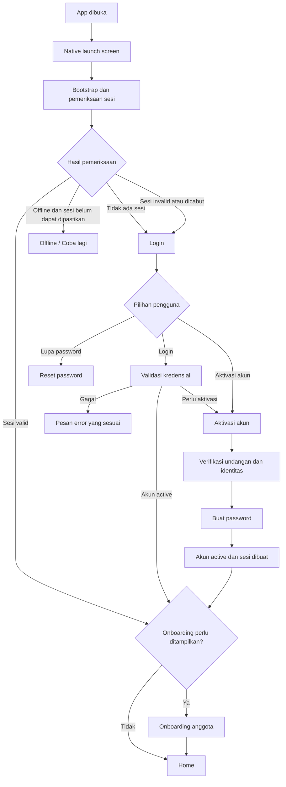

# Login, Aktivasi Akun, dan Sesi

## Status Dokumen

- Status: rancangan untuk didiskusikan; belum diterapkan di aplikasi.
- Tujuan: menyepakati alur autentikasi pengguna PALTI FX sebelum desain layar, backend, atau kode diubah.
- Asumsi utama: akun disiapkan oleh admin sebelum pengguna mengakses aplikasi. Tidak ada pendaftaran publik.
- Usulan awal: akun yang disiapkan admin berstatus `pending_activation`. Pengguna memverifikasi undangan dan membuat password sendiri ketika pertama kali mengaktifkan akun.

## Tujuan dan Batasan

### Tujuan

- Memastikan hanya pengguna yang telah diberi akses oleh admin yang dapat memakai aplikasi.
- Memisahkan aktivasi akun satu kali dari login sehari-hari.
- Mempertahankan sesi dengan aman saat aplikasi ditutup dan dibuka kembali.
- Menangani token kedaluwarsa, koneksi terputus, logout, dan pemulihan akun dengan perilaku yang jelas.

### Bukan Tujuan

- Membuka pembuatan akun mandiri untuk siapa saja.
- Menyimpan password pengguna di perangkat.
- Menentukan desain backend, penyedia email/SMS, masa berlaku token, atau detail implementasi sebelum keputusan produk disepakati.

## Istilah dan Status Akun

- **Akun disiapkan**: identitas pengguna dan hak akses sudah dibuat admin di backend.
- **Pending activation**: akun tersedia, tetapi pemiliknya belum membuktikan akses ke kontak/undangan dan belum menetapkan password.
- **Active**: akun dapat login dan menggunakan aplikasi.
- **Suspended/locked**: akses dibatasi oleh admin atau kebijakan keamanan; pengguna tidak dapat melewati batasan ini melalui aktivasi ulang.
- **Activation code**: kredensial undangan sementara yang terkait dengan satu akun. Kode ini bukan password dan bukan token sesi.
- **Access token**: kredensial berumur pendek untuk memanggil API yang membutuhkan autentikasi.
- **Refresh token**: kredensial yang dipakai untuk meminta access token baru; harus dapat dicabut dan sebaiknya dirotasi saat digunakan.

## Gambaran Alur



## Konsep Splash Screen dan Startup

### Peran Splash

Splash adalah layar transisi teknis saat aplikasi menyiapkan hal-hal minimum sebelum menentukan layar berikutnya. Splash bukan halaman promosi, onboarding, login, atau indikator bahwa pengguna sudah terautentikasi.

Pisahkan dua pengalaman yang sering disebut "splash":

1. **Native launch screen**: tampilan statis yang muncul segera ketika OS membuka aplikasi. Gunakan latar dan identitas visual PALTI FX yang sama dengan splash aplikasi. Animasi tidak perlu dipaksakan pada layer native.
2. **Bootstrap splash**: tampilan aplikasi setelah proses JavaScript dimulai, saat aplikasi menunggu font/aset penting, data lokal selesai dibaca, dan status sesi dapat ditentukan.

**Arah visual yang diusulkan:** jadikan logo PALTI FX sebagai satu-satunya fokus. Gunakan `LogoFull` dari `src/components/Logo.tsx` agar simbol dan wordmark terbaca sebagai satu lockup; gunakan `LogoMark` saja jika ukuran layar/aset native menuntut versi simbol. Hindari tagline, form, tombol, dekorasi tambahan, atau teks promosi.

Animasi cukup satu kali: logo muncul dengan fade-in dan sedikit scale ke ukuran normal, lalu diam selama bootstrap. Durasi target sekitar 350-500 ms; gerakan bukan penentu kapan aplikasi boleh lanjut. Hindari pulse/infinite loop dan animasi berlapis. Bila persiapan selesai sebelum animasi selesai, lanjutkan tanpa menunggu; bila persiapan lebih lama, logo tetap tenang dan tidak berkedip.

### Urutan Bootstrap yang Diusulkan

1. OS menampilkan native launch screen statis.
2. Setelah runtime aplikasi siap, tampilkan bootstrap splash berlogo dan mulai animasi masuk satu kali.
3. Siapkan dependensi visual yang wajib, seperti font dan aset utama. Konten yang tidak kritis tidak boleh menghalangi masuk ke aplikasi.
4. Baca data lokal yang diperlukan dan ambil kredensial sesi dari penyimpanan aman.
5. Tentukan status autentikasi:
   - Tidak ada sesi: buka Login.
   - Sesi ada dan dapat dipulihkan: lanjutkan ke Home, atau ke onboarding jika memang belum selesai.
   - Sesi dicabut/invalid: hapus sesi lokal, lalu buka Login.
   - Jaringan tidak tersedia sehingga sesi tidak dapat dipastikan: tampilkan state offline/retry, jangan salah menyimpulkan pengguna telah logout.
6. Selesaikan transisi ke layar tujuan tanpa memperlihatkan Home atau Login sekilas sebelum keputusan dibuat.

Pembacaan data non-auth seperti jurnal/setting lokal dapat berjalan terpisah bila aman, tetapi tidak boleh menentukan apakah pengguna berhak mengakses API.

### State dan Perilaku Splash

| State | Perilaku |
| --- | --- |
| Bootstrap berjalan normal | Tampilkan `LogoFull` dengan fade-in dan sedikit scale satu kali; setelah animasi, logo tetap diam. Cegah interaksi dengan layar di belakangnya. |
| Bootstrap selesai | Hilangkan splash segera dan tampilkan tujuan yang sudah diputuskan. Jangan menunggu timer animasi atau minimum display time. Hindari layar kosong/flicker. |
| Font/aset opsional gagal | Gunakan fallback visual dan lanjutkan bila aman; jangan membuat pengguna terjebak. |
| Pemeriksaan sesi gagal karena offline/timeout | Tampilkan status offline dengan Coba lagi; jangan hapus refresh token hanya karena server tidak terjangkau. |
| Sesi dinyatakan invalid/revoked oleh backend | Bersihkan sesi secara lokal dan tampilkan Login. |
| Kesalahan lokal yang fatal | Tampilkan pesan yang dapat dimengerti dan aksi coba lagi/restart; jangan menampilkan stack trace. |

### Prinsip UX dan Aksesibilitas

- Gunakan `LogoFull`/`LogoMark` dari komponen logo resmi; logo adalah satu-satunya fokus visual splash.
- Animasi hanya fade-in dan scale ringan satu kali; tidak ada pulse berulang, parallax, atau animasi dekoratif.
- Hormati reduce motion: tampilkan logo tanpa animasi atau dengan transisi opacity yang sangat singkat.
- Tidak ada input, CTA pemasaran, atau tautan kebijakan di splash.
- Splash tidak boleh memperpanjang startup hanya untuk menyelesaikan animasi.
- Hormati pengaturan reduce motion; status loading harus tetap dapat dikenali tanpa animasi.
- Pastikan kontras logo/indikator memadai dan perubahan state tidak hanya dibedakan lewat warna.
- Splash tidak menerima input pengguna. Aksi retry hanya muncul pada layar error/offline setelah bootstrap gagal.
- Jangan mengirim password, token, atau data sensitif ke analytics/log selama bootstrap.

### Perilaku Saat App Kembali dari Background

Kembali dari background tidak otomatis berarti cold start. Jangan menampilkan ulang brand splash setiap kali pengguna berpindah aplikasi. Saat app aktif kembali, lakukan validasi/refresh hanya sesuai kebijakan sesi, dan tampilkan loading lokal seperlunya. Jika refresh gagal karena offline, pertahankan state yang aman dan berikan retry; jika backend menyatakan sesi dicabut, arahkan ke Login.

## Konsep Onboarding Anggota

### Batas Onboarding

Onboarding menjelaskan cara memakai produk; onboarding **bukan** proses membuat akun, aktivasi undangan, verifikasi OTP, persetujuan Terms, atau login. Karena akses PALTI FX bersifat undangan, pengguna tanpa sesi diarahkan ke Login/Aktivasi, bukan diberi kesan bahwa melewati onboarding akan membuat akun.

**Usulan penempatan:** tampilkan onboarding satu kali setelah login pertama yang berhasil atau setelah aktivasi akun selesai. Setelah selesai atau dilewati, masuk ke Home. Login berikutnya langsung ke Home kecuali ada onboarding versi baru yang memang perlu diperkenalkan.

Pilihan ini menjaga detail fitur privat tidak ditampilkan sebelum identitas pengguna diverifikasi. Jika onboarding publik sebelum login dianggap perlu, informasi yang tampil harus disetujui sebagai konten publik dan tidak boleh menjadi pengganti Login.

### Tujuan Onboarding

- Memberi orientasi singkat tentang manfaat utama PALTI FX.
- Menunjukkan letak bagian yang membantu pengguna mulai tanpa meminta mereka mengambil keputusan finansial.
- Mengurangi kejutan saat pertama kali melihat Home dan navigasi.
- Tidak meminta informasi yang sudah dimiliki admin, password, activation code, atau data finansial.

### Urutan Layar yang Diusulkan

Onboarding terdiri dari tiga layar yang dapat dilewati. Setiap layar menyampaikan satu manfaat, bukan instruksi panjang atau tur yang memaksa pengguna mengetuk elemen tertentu.

| Langkah | Pesan utama | Contoh judul dan copy | Visual yang disarankan |
| --- | --- | --- | --- |
| 1. Belajar | Materi disusun agar pengguna dapat membangun pemahaman secara bertahap. | **Belajar dengan terarah** — "Jelajahi materi forex dari dasar, lalu lanjutkan belajar sesuai progresmu." | Preview modul belajar dan penanda progres; jangan memakai chart harga yang memberi kesan rekomendasi pasar. |
| 2. Kalkulator | Alat bantu membantu pengguna memahami angka dan risiko sebelum membuat keputusan sendiri. | **Pahami risiko sebelum membuka posisi** — "Gunakan kalkulator untuk mengeksplorasi ukuran lot, nilai pip, dan risk-reward." | Preview kalkulator atau hubungan sederhana antara input dan hasil, tanpa menyiratkan bahwa hasil kalkulasi menjamin trade aman/untung. |
| 3. Jurnal | Pencatatan membuat pengguna dapat meninjau keputusan dan hasilnya. | **Catat dan evaluasi prosesmu** — "Simpan ringkasan trade dan lihat kembali pola dari waktu ke waktu." | Preview jurnal/equity yang bersifat ilustratif; gunakan data contoh yang jelas bukan data pengguna. |

Di semua langkah, tampilkan logo/identitas secara kecil dan konsisten, indikator **Langkah X dari 3**, tombol **Lewati**, serta tombol utama **Lanjut**. Pada langkah pertama, **Kembali** tidak diperlukan. Pada langkah kedua dan ketiga, sediakan **Kembali**. Langkah ketiga mengganti **Lanjut** menjadi **Mulai menggunakan PALTI FX**. Setelah aksi utama, buka Home.

Gunakan transisi horizontal singkat atau fade antar-layar, dengan arah yang konsisten dan dukungan reduce motion. Hindari autoplay, swipe sebagai satu-satunya navigasi, carousel yang tidak memiliki tombol, dan animasi yang menyamarkan perubahan konten. Seluruh isi harus terbaca tanpa menunggu animasi.

### Tata Letak dan Interaksi

- Satu pesan utama per layar: judul, paling banyak dua kalimat pendukung, visual fitur, progress, dan kontrol navigasi.
- Letakkan **Lewati** konsisten di bagian atas; letakkan **Kembali** dan tombol utama di area bawah yang mudah dijangkau.
- Beri label tombol yang menyebut aksi, bukan ikon saja. Area tekan cukup besar dan tidak saling berhimpitan.
- Tampilkan langkah aktif dengan angka/teks selain warna, misalnya "Langkah 2 dari 3".
- Teks dapat di-scroll pada layar pendek atau saat ukuran font diperbesar; tombol navigasi tetap dapat diakses.
- Jangan meminta nama, email, password, kode undangan, izin notifikasi, atau data finansial di onboarding. Izin hanya diminta saat fitur yang memerlukannya digunakan dan alasannya jelas.
- Hindari klaim hasil, janji profit, rekomendasi trading, atau copy yang dapat dibaca sebagai saran investasi.

### Perilaku Skip dan Penyelesaian

- **Lewati** langsung menandai onboarding versi tersebut selesai/dilewati lalu membuka Home; tidak ada modal konfirmasi untuk alur tiga langkah ini.
- Tombol akhir **Mulai menggunakan PALTI FX** menyelesaikan onboarding dan membuka Home.
- Tombol **Kembali** hanya mengubah langkah; tidak menghapus jawaban atau data akun karena onboarding tidak mengumpulkan data.
- Tombol Android Back kembali satu langkah. Dari langkah pertama, Back tidak boleh keluar aplikasi tanpa sengaja; perlakukan sebagai tetap di onboarding atau tampilkan perilaku navigasi aplikasi yang sudah disepakati.
- Bila aplikasi ditutup sebelum selesai, pengguna akan melihat onboarding lagi setelah sesi dipulihkan. Rekomendasi awal: mulai lagi dari langkah pertama karena hanya tiga layar dan tidak ada data yang perlu dipulihkan.

Nama panggilan tidak diperlukan untuk aktivasi atau akses. Jika sapaan personal ingin dipertahankan, jadikan pengaturan profil opsional dan dapat diubah nanti; nama panggilan tidak boleh dianggap sebagai verifikasi identitas akun.

### Aturan Progress dan Kemunculan Ulang

- Completion baru dicatat setelah pengguna menekan **Mulai menggunakan PALTI FX** atau secara eksplisit memilih Lewati.
- Jika aplikasi ditutup di tengah onboarding, rekomendasi awal adalah mulai kembali dari langkah pertama; progres satu/tiga langkah tidak perlu disimpan kecuali ada alasan produk yang kuat.
- Setelah selesai/dilewati, onboarding tidak muncul pada setiap login atau app launch.
- Sediakan akses untuk melihat ulang panduan dari bagian Bantuan/Profil bila memang dibutuhkan.
- Gunakan versi onboarding yang eksplisit, bukan satu boolean permanen. Perubahan minor teks tidak perlu memunculkan ulang onboarding; perubahan alur yang material dapat menaikkan versi.
- Rekomendasi: simpan versi onboarding yang sudah selesai per akun agar onboarding tidak muncul kembali saat pengguna login di perangkat lain. Backend menjadi sumber utama bila tersedia; cache lokal boleh dipakai untuk tampilan. Jangan gunakan satu flag global perangkat seperti `settings.welcomed` untuk semua akun.
- Jangan mencampur status onboarding dengan persetujuan Terms. Persetujuan legal harus dicatat terpisah, eksplisit, dan dapat diaudit.

### Aksesibilitas dan Kondisi Perangkat

- Setiap langkah mendukung VoiceOver/TalkBack dengan urutan baca yang logis dan label tombol yang bermakna.
- Teks tetap terbaca pada ukuran font aksesibilitas dan layar kecil; konten dapat di-scroll bila tinggi layar terbatas.
- Progress memiliki keterangan teks, misalnya "Langkah 2 dari 3", bukan hanya titik berwarna.
- Tombol Lewati dan Lanjut mudah dijangkau, tidak saling tertukar, dan memiliki area sentuh memadai.
- Animasi boleh memperhalus perpindahan tetapi tidak boleh menunda navigasi atau menyampaikan informasi penting sendirian.

### State Onboarding

| Kondisi | Perilaku |
| --- | --- |
| Login/aktivasi berhasil, onboarding belum selesai | Tampilkan langkah pertama onboarding. |
| Pengguna memilih Lewati | Tandai versi tersebut selesai/dilewati, lalu buka Home. |
| Pengguna menyelesaikan langkah terakhir | Tandai versi selesai, lalu buka Home. |
| App ditutup di tengah langkah | Saat dibuka lagi, pulihkan sesi lebih dulu; tampilkan onboarding lagi hanya jika statusnya belum selesai dan aturan produk menghendaki. |
| Onboarding versi ini sudah selesai | Lewati onboarding dan buka Home. |
| Pengguna logout | Hapus sesi, bukan progress onboarding. Jika pengguna login kembali dengan akun yang sama, jangan tampilkan lagi versi onboarding yang sudah selesai/dilewati. |
| Pengguna berpindah langkah lalu memakai Back | Kembali ke langkah sebelumnya tanpa mengubah status completion. |
| Reduce motion aktif | Hilangkan gerak slide/scale; perubahan langkah tetap terlihat melalui konten dan indikator progress. |
| Layar kecil/teks diperbesar | Izinkan konten utama scroll; kontrol Lewati dan navigasi tetap dapat ditemukan dan dioperasikan. |

## Kondisi Saat Ini di Aplikasi

Pada implementasi sekarang, `Splash` hanya tampil ketika font belum selesai dimuat dan menggunakan `LogoMark` dengan pulse berulang. `WelcomeGate` menutupi layar utama selama `settings.welcomed` belum true; `WelcomeScreen` menampilkan sapaan, meminta nama panggilan, lalu menyimpan status tersebut lewat store lokal. Ini adalah layar sambutan satu kali, belum merupakan bootstrap sesi maupun onboarding bertahap.

Karena itu, rancangan ini menyarankan pemisahan tanggung jawab sebelum implementasi autentikasi: bootstrap menampilkan logo dengan animasi sederhana lalu menentukan tujuan berdasarkan kesiapan dan sesi; Login/Aktivasi menangani akses akun; onboarding tiga langkah muncul setelah autentikasi pertama. `settings.welcomed` dan input nama perlu ditinjau terpisah sebelum dipakai sebagai status onboarding. Bagian ini hanya mencatat kondisi dan arah konsep, tidak mengubah kode.

## 1. Persiapan Akun oleh Admin

1. Admin membuat akun melalui alat administrasi yang disetujui.
2. Backend menyimpan identitas dan hak akses akun dengan status `pending_activation`.
3. Backend membuat undangan unik yang terikat pada akun tersebut.
4. Admin atau backend mengirim undangan ke kanal yang sudah diverifikasi, atau memberikan kode melalui proses internal yang disepakati.
5. Undangan memiliki masa berlaku, batas percobaan, dan hanya dapat digunakan satu kali.
6. Admin dapat membatalkan atau menerbitkan ulang undangan. Penerbitan ulang membatalkan kode sebelumnya.

Kode undangan tidak boleh menjadi kode umum yang dapat membuat akun baru. Backend harus mengikat kode ke akun yang tepat dan memeriksa status akun saat kode digunakan.

## 2. Pengguna Pertama Kali Membuka Aplikasi

1. Setelah bootstrap selesai, bila tidak ada sesi yang dapat dipulihkan, tampilkan halaman **Login**.
2. Halaman Login menyediakan:
   - Email atau username.
   - Password.
   - Tampilkan/sembunyikan password.
   - Tombol Login.
   - Tautan Aktivasi akun.
   - Tautan Lupa password.
3. Jangan tampilkan tombol Daftar atau alur pembuatan akun publik.
4. Pengguna yang sudah mengaktifkan akunnya dapat langsung login.
5. Pengguna dengan akun `pending_activation` mengikuti alur aktivasi, bukan membuat identitas baru.
6. Setelah login/aktivasi pertama berhasil, tampilkan onboarding anggota jika versi onboarding yang berlaku belum selesai; jika sudah selesai, buka Home.

## 3. Aktivasi Akun Undangan

1. Pengguna memilih **Aktivasi akun** dari halaman Login.
2. Pengguna memasukkan kode undangan. Jika produk mengharuskan pencarian akun lewat email/username, backend tetap harus memeriksa bahwa kode dan identitas tersebut cocok.
3. Aplikasi mengirim data aktivasi ke backend melalui koneksi HTTPS. Validitas kode dan status akun diputuskan oleh backend, bukan hanya oleh aplikasi.
4. Jika undangan valid, backend membuktikan kepemilikan kontak yang terdaftar, misalnya melalui OTP email. Kebutuhan OTP dan kanalnya perlu diputuskan sebelum implementasi.
5. Pengguna menetapkan password baru dan mengonfirmasikannya. Aplikasi mengirim password melalui HTTPS untuk diverifikasi/disimpan sebagai hash oleh backend; aplikasi tidak menyimpan password.
6. Backend mengubah status akun menjadi `active`, menandai undangan sudah terpakai, dan mencatat penerimaan syarat/kebijakan yang diperlukan beserta versinya.
7. Usulan pengalaman: setelah aktivasi berhasil, backend menerbitkan sesi dan aplikasi memeriksa versi onboarding. Jika belum selesai, tampilkan onboarding; setelah diselesaikan/dilewati, buka Home. Login terpisah tidak diperlukan kecuali ada kebijakan keamanan yang mengharuskannya.
8. Kode tidak valid, kedaluwarsa, sudah dipakai, dibatalkan, atau terlalu banyak percobaan menghasilkan instruksi pemulihan yang aman. Jangan mengungkap detail akun yang tidak diperlukan.

## 4. Login Sehari-hari

1. Pengguna memasukkan email/username dan password.
2. Aplikasi mengirim permintaan login ke backend melalui HTTPS.
3. Backend memverifikasi password dan status akun.
4. Jika akun `active`, backend menerbitkan access token dan refresh token sesuai kebijakan sesi.
5. Aplikasi menyimpan token menggunakan penyimpanan kredensial aman yang sesuai platform. Jangan menyimpannya sebagai password, jangan menulis token ke log, dan jangan menganggap penyimpanan biasa setara dengan penyimpanan aman.
6. Setelah login berhasil, periksa status onboarding untuk akun tersebut. Tampilkan onboarding yang belum selesai; jika sudah selesai, lanjutkan ke Home.
7. Jika akun masih `pending_activation`, arahkan ke aktivasi. Jika akun `suspended/locked`, tampilkan jalur bantuan yang sesuai; jangan menawarkan pembuatan akun baru.

### Kebijakan "Remember Me"

Di aplikasi mobile, sesi persisten biasanya menjadi perilaku default, sehingga checkbox **Remember Me** berpotensi membingungkan. Usulan awal: hilangkan checkbox tersebut dan jelaskan hanya bila diperlukan bahwa pengguna akan tetap login sampai logout atau sesi dicabut. Jika produk membutuhkan pilihan durasi sesi, tentukan konsekuensinya secara eksplisit sebelum menambah kontrol.

## 5. Pembukaan Ulang Aplikasi dan Pemulihan Sesi

Menutup aplikasi tidak sama dengan logout. Saat aplikasi dibuka kembali:

1. Tampilkan splash/loading selama pemeriksaan sesi; hindari menampilkan halaman Login sebentar sebelum mengetahui hasilnya.
2. Jika tidak ada refresh token, arahkan ke Login.
3. Jika ada token, validasi/pulihkan sesi dengan backend. Pemeriksaan waktu kedaluwarsa lokal hanya optimasi, bukan sumber kebenaran.
4. Jika sesi valid, masuk ke Home.
5. Jika access token kedaluwarsa tetapi refresh token valid, minta access token baru lalu lanjutkan ke halaman yang diminta.
6. Jika refresh token kedaluwarsa, dicabut, atau ditolak, hapus kredensial lokal dan arahkan ke Login dengan pesan sesi berakhir.
7. Jika backend tidak dapat dijangkau karena perangkat offline, jangan otomatis menganggap token dicabut atau menghapus sesi. Tampilkan keadaan offline dan tombol Coba lagi. Kebijakan apakah konten tertentu boleh dibuka offline perlu diputuskan terpisah.

## 6. Masa Berlaku dan Refresh Token

- Access token berumur pendek dan dikirim hanya ke API yang membutuhkan autentikasi.
- Refresh token berumur lebih panjang, disimpan di penyimpanan aman, dan hanya digunakan pada endpoint refresh.
- Backend adalah sumber kebenaran untuk validitas, pencabutan, rotasi, dan masa berlaku token.
- Jika refresh gagal karena token invalid/revoked, akhiri sesi lokal. Jika gagal karena jaringan/server, pertahankan sesi lokal dan sediakan retry; jangan menyamakan kegagalan jaringan dengan logout.
- Backend sebaiknya mendeteksi penggunaan ulang refresh token yang sudah dirotasi dan dapat mencabut keluarga sesi terkait.
- Jika refresh dapat terjadi dari beberapa request bersamaan, aplikasi perlu mencegah banyak refresh paralel dan mengulang request yang gagal secara terkendali.

## 7. Lupa dan Reset Password

1. Pengguna memilih **Lupa password** di halaman Login.
2. Pengguna memasukkan email/username yang terdaftar.
3. Backend mengirim instruksi reset ke kontak terverifikasi.
4. Respons awal sebaiknya tidak membocorkan apakah suatu email/username terdaftar.
5. Token/kode reset harus terbatas waktu, sekali pakai, dan terpisah dari activation code.
6. Setelah password diganti, backend menerapkan kebijakan sesi yang dipilih: mempertahankan sesi lain atau mencabutnya.
7. Pengguna mendapat konfirmasi dan mengikuti kebijakan login kembali yang disepakati.

## 8. Logout

1. Pengguna memilih Logout dari Profile/Settings.
2. Tampilkan konfirmasi bila tindakan mudah terpicu tanpa sengaja.
3. Setelah dikonfirmasi, aplikasi meminta backend mencabut refresh token/sesi perangkat bila endpoint tersedia.
4. Aplikasi menghapus access token, refresh token, dan data autentikasi lokal dari penyimpanan aman, termasuk bila permintaan pencabutan gagal.
5. Arahkan ke Login dan tampilkan pesan bahwa pengguna telah logout.
6. Saat aplikasi dibuka kembali, tidak ada sesi lokal sehingga pengguna tetap berada di Login.

Logout pada satu perangkat dan **Logout dari semua perangkat** adalah tindakan berbeda. Jika fitur kedua dibutuhkan, tampilkan sebagai aksi terpisah dan pastikan backend mendukung pencabutan semua sesi.

## 9. Status dan Pesan Error

| Kondisi | Perilaku yang disarankan |
| --- | --- |
| Email/username atau password salah | Pesan umum: kredensial tidak cocok; jangan mengungkap field mana yang valid. Beri kesempatan mencoba lagi dengan rate limit. |
| Akun perlu aktivasi | Arahkan ke Aktivasi akun atau kirim ulang undangan melalui proses yang aman. |
| Undangan invalid/kedaluwarsa/sudah dipakai | Jelaskan langkah berikutnya, misalnya minta undangan baru kepada admin. |
| Akun terkunci/suspended | Tampilkan status yang aman dan cara menghubungi admin/support. |
| Tidak ada internet | Pertahankan input yang aman, tampilkan status offline, dan sediakan Coba lagi. Jangan hapus sesi. |
| Timeout/server error | Tampilkan kegagalan sementara dan retry; jangan menyatakan password salah. |
| Access token kedaluwarsa | Coba refresh secara transparan satu kali sesuai kebijakan. |
| Refresh token invalid/revoked | Hapus sesi lokal dan arahkan ke Login. |
| OTP salah/kedaluwarsa | Beri retry terbatas dan opsi kirim ulang dengan cooldown. |
| Terlalu banyak percobaan | Tampilkan kapan dapat mencoba lagi atau jalur bantuan tanpa membuka detail keamanan internal. |

Pesan error harus singkat, dapat dipahami, tidak menampilkan stack trace/token, dan tidak menghapus input yang tidak sensitif tanpa alasan.

## 10. Prinsip Keamanan

- Password hanya dikirim melalui HTTPS dan diverifikasi di backend menggunakan algoritma hash password yang sesuai. Password tidak disimpan plaintext di backend maupun perangkat.
- Activation code, OTP, reset token, access token, dan refresh token memiliki tujuan berbeda dan tidak boleh saling menggantikan.
- Token rahasia tidak disimpan di log, analytics, URL, atau pesan error.
- Endpoint login, aktivasi, OTP, dan reset password memerlukan rate limiting dan pemantauan percobaan yang wajar.
- Backend memvalidasi status akun dan hak akses pada setiap operasi yang relevan. Menyembunyikan tombol di aplikasi bukan kontrol akses.
- Perubahan status akun oleh admin harus berlaku juga pada sesi yang sudah berjalan sesuai kebijakan pencabutan.
- Persyaratan panjang password, passphrase, reuse, dan pemblokiran password umum harus disepakati bersama backend/product sebelum implementasi.

## 11. Kriteria Penerimaan Rancangan

- Tidak ada pendaftaran publik; akun hanya tersedia setelah disiapkan admin.
- Pengguna dengan akun aktif dapat login tanpa melewati aktivasi.
- Pengguna dengan akun `pending_activation` dapat mengaktifkan akun yang memang diundang, bukan membuat akun baru.
- Penutupan aplikasi tidak otomatis menghapus sesi.
- Sesi valid dipulihkan; token yang dicabut tidak dapat memulihkan sesi.
- Kegagalan jaringan dapat dibedakan dari sesi yang benar-benar tidak valid.
- Logout menghapus kredensial lokal dan mencabut sesi server sesuai kemampuan backend.
- Password tidak disimpan di perangkat dan token tidak dicatat ke log.
- Error login/aktivasi/reset tidak membocorkan keberadaan akun secara tidak perlu.

## 12. Keputusan yang Masih Terbuka

Sebelum flow dianggap final, sepakati poin-poin berikut:

1. Siapa yang membuat akun dan dari alat apa: admin satu per satu, impor daftar, atau sistem lain?
2. Apakah aktivasi memakai kode, tautan undangan, OTP, atau kombinasi? Kanal pengirimannya apa?
3. Apakah email/nomor kontak sudah diverifikasi oleh admin sebelum undangan dikirim?
4. Apakah setelah aktivasi pengguna langsung masuk, atau harus login secara terpisah?
5. Berapa lama undangan, OTP, access token, dan refresh token berlaku; berapa batas percobaannya?
6. Apakah beberapa perangkat boleh login bersamaan? Apa cakupan Logout biasa dan Logout semua perangkat?
7. Setelah reset password, apakah sesi di perangkat lain harus dicabut?
8. Apakah aplikasi perlu membuka konten tertentu saat offline?
9. Apakah diperlukan verifikasi tambahan, seperti MFA atau biometrik untuk membuka kembali aplikasi?
10. Apa jalur pengguna jika undangan hilang, email tidak dapat diakses, atau admin salah memasukkan data?

## 13. Ringkasan Alur yang Diusulkan

```text
Admin menyiapkan akun (pending_activation)
    -> Backend mengirim/memberikan undangan yang terikat ke akun
    -> Pengguna membuka aplikasi
    -> Belum ada sesi: Login
    -> Akun sudah active: Login -> Home
    -> Akun pending_activation: Aktivasi -> Verifikasi -> Buat password -> Home
    -> Aplikasi dibuka lagi dengan sesi valid: Pulihkan sesi -> Home
    -> Sesi tidak valid/dicabut: Hapus sesi lokal -> Login
```
