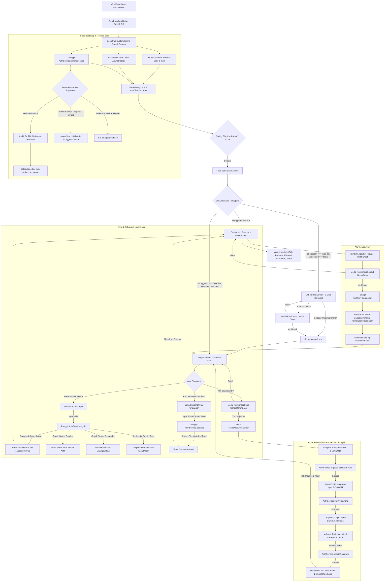

# Spesifikasi Lengkap & Mendalam Alur Autentikasi, Onboarding, dan Sesi PALTI FX

## Status Dokumen
- **Status**: Implementasi Aktif di Produksi (*Production Implementation Specification & Architectural Blueprint*).
- **Cakupan Dokumen**: Perincian Menyeluruh 6 Komponen Utama (Splash Screen, Onboarding Screen, Login Screen, OTP Screen, Password Screen, Account Activation Screen), Lifecycle Sesi, UI/UX Glassmorphism, Integrasi Database & Trigger Supabase, Storage Enkripsi, serta Logika Error Handling.
- **Teknologi**: Expo SDK 57 (React Native 0.86, React 19), Supabase Auth JS v2 (`@supabase/supabase-js`), `expo-secure-store`, `AsyncStorage`, `expo-blur`, `expo-linear-gradient`, `expo-haptics`.
- **Karakteristik Akses**: **Zero Public Signup** (Pendaftaran murni berbasis undangan terkelola / *Admin Provisioned Invitation System*).

---

## 1. Arsitektur Alur & State Machine Global

Aplikasi menggunakan alur navigasi deterministik yang mengatur transisi sejak aplikasi pertama kali dibuka (*cold start*), pengecekan sesi terenkripsi, hingga penentuan layar yang tampil.



---

## 2. Perincian Menyeluruh 6 Komponen Layar (UI/UX & Logika Interaksi)

Berikut adalah bedah komponen mendalam dari ke-6 layar autentikasi dan onboarding yang ada di kode sumber aplikasi:

```
┌─────────────────────────────────────────────────────────────────────────────────┐
│                           6 LAYAR UTAMA AUTENTIKASI                             │
├─────────────────┬──────────────────┬─────────────────┬──────────────────────────┤
│ 1. Splash Screen│ 2. Onboarding    │ 3. Login Screen │ 4. OTP Screen (Step 1)   │
├─────────────────┴──────────────────┼─────────────────┴──────────────────────────┤
│ 5. Password Screen (Step 2)        │ 6. Account Activation Screen (Sheet)       │
└────────────────────────────────────┴────────────────────────────────────────────┘
```

---

### 2.1 Perincian 1: Splash Screen & Startup Bootstrap
- **Lokasi Kode:** [App.tsx](file:///c:/Work/palti-fx/palti-fx/frontend/App.tsx#L160-L225)
- **Komponen Visual:** `LogoMark` resmi bergradien emas ukuran besar (142px) di tengah latar Obsidian Slate (`#07090E`).
- **Logika Fisika Animasi (*Spring Physics*):**
  - **Rotasi Alami:** Masuk miring dari sudut `-24deg` berputar halus ke `0deg`.
  - **Skala Masuk:** Membesar dari `0.68` menuju `1.0`.
  - **Kurva Opacity:** Menggunakan interpolasi `[0, 0.35, 1]` ke output `[0, 1, 1]`.
  - **Karakteristik Spring:** Dijalankan dengan `tension: 28` dan `friction: 9` menggunakan native driver (`useNativeDriver: true`), menghasilkan pendaratan tanpa pantulan buatan.
- **Settle & Dissolve Exit:**
  - Timer settling berjalan selama **1.400 ms (1.4 detik)**.
  - Setelah settle, logo larut keluar (*fade-out opacity*) selama **380 ms** dengan `Easing.out(Easing.quad)`.
- **Sinkronisasi Native OS Splash:**
  - `SplashScreen.hideAsync()` dipanggil tepat saat runtime JavaScript siap.
- **Layar Blocker Anti-Flicker:**
  - Sebelum kondisi `ready`, `fontsLoaded` (Google Fonts Plus Jakarta Sans), dan `authChecked` terpenuhi, sistem merender container statis dengan LogoMark 142px agar tidak terjadi kedipan layar (*glitch*).

---

### 2.2 Perincian 2: Onboarding Screen (Showcase & Gesture Carousel)
- **Lokasi Kode:** [OnboardingScreen.tsx](file:///c:/Work/palti-fx/palti-fx/frontend/src/screens/OnboardingScreen.tsx)
- **Struktur Tampilan:**
  1. **Top Bar:** Wordmark PALTI FX + LogoMark (32px) di kiri atas, dan tombol kapsul semi-transparan **"Lewati"** di kanan atas (`rgba(255,255,255,0.06)`).
  2. **Kartu Showcase Interaktif (Interaksi Fisika PanResponder):**
     - Kartu ilustrasi di tengah layar merespons sentuhan geser vertikal (*swipe gesture*).
     - Memiliki dua mode posisi: `resting` (posisi normal `cardY: 0`) dan `expanded` (posisi naik `cardY: -100`).
     - Menggunakan spring `tension: 65, friction: 10` dengan *rubber-band clamping* batas atas `-135` dan batas bawah `+25`.
  3. **3 Langkah Slide Carousel:**
     - **Slide 1: Kurikulum Trading (`IlluLearn`)**
       - *Headline:* "Belajar Terarah\nTanpa Rumit"
       - *Deskripsi:* "Pelajari konsep dasar pasar forex, istilah teknis penting, hingga strategi risiko terukur melalui kurikulum ringkas yang tersusun bertahap."
       - *Visual Kartu:* Daftar modul (Modul 1 "Dasar Pasar & Istilah Forex" centang selesai, Modul 2 "Manajemen Risiko & Lot" progress bar aktif beraksen emas 65%, Modul 3 "Psikologi & Jurnal" terkunci gembok).
     - **Slide 2: Smart Trading Tools (`IlluCalc`)**
       - *Headline:* "Kalkulator Risiko\nPresisi & Praktis"
       - *Deskripsi:* "Hitung ukuran lot ideal dan estimasi batasan risiko secara objektif sebelum membuka posisi agar modal akun tetap terlindungi."
       - *Visual Kartu:* Grid parameter simulator (Modal $1.000, Batas Risiko 1.0% / $10, Stop Loss 20 Pips, Target 40 Pips 1:2) + Hero Display hasil perhitungan lot `0.05 Lot`.
     - **Slide 3: Jurnal & Evaluasi Objektif (`IlluJournal`)**
       - *Headline:* "Catat & Evaluasi\nJurnal Trading"
       - *Deskripsi:* "Dokumentasikan setiap eksekusi, pantau perkembangan performa equity, dan temukan pola transaksi terbaikmu untuk menjaga konsistensi trading."
       - *Visual Kartu:* Metrik kartu equity (24 Trade, Profit Factor 2.4x, Net Profit `+$345.00` beraksen emas) + mini 10-bar chart mingguan.
  4. **Kontrol Navigasi Bawah:**
     - Indikator strip progres (3 garis halus horizontal).
     - Pill status: `"Langkah 1 dari 3"`, `"Langkah 2 dari 3"`, `"Langkah 3 dari 3"`.
     - Tombol Kembali di kiri (muncul di slide 2 dan 3).
     - Tombol Aksi Kanan: `"Lanjut"` pada slide 1 & 2, dan `"Mulai Sekarang"` bergradien emas penuh pada slide 3.
  5. **Modal Konfirmasi Lewati Onboarding:**
     - Jika tombol *"Lewati"* ditekan, muncul pop-up dark glass (`rgba(12, 16, 24, 0.88)`):
       - *Judul:* "Lewati Pengenalan?"
       - *Deskripsi:* "Kamu akan langsung diarahkan ke halaman login akun."
       - *Aksi:* Tombol "Batal" dan "Ya, Masuk".

---

### 2.3 Perincian 3: Login Screen ("Masuk ke Akun")
- **Lokasi Kode:** [LoginScreen.tsx](file:///c:/Work/palti-fx/palti-fx/frontend/src/screens/LoginScreen.tsx)
- **Header Identitas:** LogoMark emas 56px + Wordmark 110px + Tagline `"PORTAL TRADER"`.
- **Card Container Glassmorphism:**
  - Menggunakan `BlurView` (intensity 40 iOS / 25 Android).
  - Dilengkapi `cardSheen` linear gradient atas dan border glow halus di sisi kiri dan kanan.
  - Judul: *"Masuk ke Akun"*, Subjudul: *"Gunakan akun yang telah disiapkan admin"*.
- **Input Field 1: Email atau Username / ID Member:**
  - Label: `EMAIL ATAU USERNAME`.
  - Ikon: `mail-outline`.
  - Tombol Clear: Muncul ikon silang `close-circle` saat kolom berisi teks untuk menghapus instan.
  - Validasi On-Blur: Jika input mengandung `@`, sistem otomatis mengecek validitas domain email dan memunculkan peringatan format jika salah.
  - Fleksibilitas: Menerima alamat email biasa ATAU ID Member resmi (`PFX-XXXXXXXX`).
- **Input Field 2: Kata Sandi:**
  - Label: `KATA SANDI` bersanding dengan tautan emas *"Lupa sandi?"*.
  - Ikon: `lock-closed-outline`.
  - Toggle Show/Hide: Ikon mata (`eye-outline` / `eye-off-outline`) dengan hitSlop nyaman (12px).
- **Banner Error Kaca Merah (`errBanner`):**
  - Muncul jika login gagal, menampilkan ikon lingkaran seru dan pesan error berbahasa Indonesia.
- **Tombol Masuk:**
  - Menggunakan `goldGradient` penuh, animasi penyusutan saat ditekan (`scaleTo: 0.97`).
  - Dinonaktifkan (opacity 50%) bila field belum lengkap.
  - State submitting: Menampilkan `ActivityIndicator` dan teks *"Memverifikasi..."*.
- **Pemisah & Tombol Aktivasi:**
  - Pembatas garis tipis dengan teks tengah `"atau"`.
  - Tombol sekunder: *"Aktivasi Akun Baru"* (membuka modal aktivasi).
- **Footer Support:**
  - Teks *"Butuh bantuan akses? Hubungi Admin"* yang terhubung ke kontak admin resmi.

---

### 2.4 Perincian 4: OTP Screen (ResetPasswordScreen - Langkah 1)
- **Lokasi Kode:** [ResetPasswordScreen.tsx](file:///c:/Work/palti-fx/palti-fx/frontend/src/screens/ResetPasswordScreen.tsx#L258-L400)
- **Header:** LogoMark 50px + Wordmark 105px + Tagline `"Pemulihan Akun"`.
- **Stepper Navigasi 2-Langkah:**
  - Step 1: Lingkaran angka `1` menyala emas + Label `"Kode OTP"`.
  - Garis pembatas tipis.
  - Step 2: Lingkaran angka `2` abu-abu redup + Label `"Sandi Baru"`.
- **Card Content:**
  - Judul: *"Verifikasi Kode OTP"*, Subjudul: *"Masukkan email akun Anda untuk menerima kode OTP verifikasi."*
- **Field 1: Email atau Username:**
  - Pre-filled otomatis jika pengguna sebelumnya sudah mengetikkannya di layar login.
  - Ikon surat + tombol silang hapus cepat.
- **Tombol Mandiri "Kirim Kode OTP":**
  - Berdiri sendiri di bawah input email dengan ikon pesawat kertas (`paper-plane-outline`).
  - Menjalankan `AuthService.requestPasswordReset()`.
  - **Cooldown Timer 60 Detik:** Menampilkan hitung mundur waktu tunggu otomatis (*"Kirim Ulang Kode OTP (59s)"*) dan tombol dikunci selama timer berjalan untuk mencegah pemblokiran limit API.
- **Field 2: Kode OTP:**
  - Label dilengkapi teks pendamping: *"Kode telah dikirim"* saat OTP berhasil terkirim.
  - Ikon kunci `key-outline`, keyboard `number-pad`, batas panjang 8 digit (menerima 6-8 digit).
  - Sanitasi otomatis: Hanya menerima angka (`replace(/[^0-9]/g, '')`).
- **Tombol "Verifikasi & Lanjutkan":**
  - Aktif setelah email dan minimal 6 digit OTP terisi.
  - Memanggil `AuthService.verifyResetOtp()`. Jika OTP valid, Supabase menerbitkan sesi recovery sementara dan layar berganti ke Langkah 2.
- **Tombol Footer:** Pembatas `"atau"` dan tombol *"Kembali ke Login"*.

---

### 2.5 Perincian 5: Password Screen (ResetPasswordScreen - Langkah 2)
- **Lokasi Kode:** [ResetPasswordScreen.tsx](file:///c:/Work/palti-fx/palti-fx/frontend/src/screens/ResetPasswordScreen.tsx#L402-L550)
- **Stepper Status:** Lingkaran angka `2` kini aktif menyala emas.
- **Card Content:**
  - Judul: *"Buat Kata Sandi Baru"*, Subjudul: *"Gunakan kombinasi minimal 8 karakter agar akun Anda tetap aman."*
- **Field 1: Kata Sandi Baru:**
  - Ikon gembok, toggle mata show/hide, returnKeyType `"next"` (otomatis memindahkan kursor ke konfirmasi).
- **Field 2: Konfirmasi Kata Sandi Baru:**
  - Ikon gembok, toggle mata show/hide independen, returnKeyType `"done"`.
- **Daftar Checklist Persyaratan Real-Time (`reqList`):**
  - Membantu pengguna memverifikasi kekuatan password sebelum menekan tombol simpan:
    1. **Minimal 8 karakter:** Ikon lingkaran otomatis berubah menjadi centang hijau `checkmark-circle` dan teks menyala terang saat panjang `>= 8`.
    2. **Kata sandi cocok:** Ikon berubah menjadi centang hijau saat kata sandi kedua identik dengan kata sandi pertama.
- **Tombol "Simpan Kata Sandi Baru":**
  - Memanggil `AuthService.updatePassword()`.
  - State memuat: Spinner + teks *"Menyimpan..."*.
  - Sesi recovery Supabase langsung dibersihkan (`signOut({ scope: 'local' })`) demi keamanan.
- **Pengaman Tombol Back Hardware & UI:**
  - Jika pengguna menekan tombol kembali saat di Step 2, sistem memunculkan Modal Konfirmasi:
    > *"Batalkan Pemulihan Sandi? Sesi pengaturan ulang kata sandi Anda akan dibatalkan."*
  - Jika dibatalkan atau komponen unmount sebelum sukses, sesi recovery ditutup seketika.
- **Pop-up Sukses Dark Glass (`showSuccessModal`):**
  - *Judul:* "Kata Sandi Diperbarui"
  - *Deskripsi:* "Kata sandi Anda berhasil diperbarui. Silakan masuk kembali menggunakan kata sandi baru Anda."
  - *Aksi:* Tombol emas full-width *"Masuk ke Akun"*, mengarahkan pengguna kembali ke Login Screen dengan aman.

---

### 2.6 Perincian 6: Account Activation Screen (Sheet Aktivasi Undangan)
- **Lokasi Kode:** [LoginScreen.tsx](file:///c:/Work/palti-fx/palti-fx/frontend/src/screens/LoginScreen.tsx#L530-L760)
- **Pemicu Tampil:**
  1. Pengguna menekan tombol *"Aktivasi Akun Baru"* di layar login.
  2. Pengguna mencoba login dengan email yang memiliki undangan sah tapi belum diaktifkan (muncul via *Pending Sheet*).
- **Tampilan Modal / Sheet Dark Glass:**
  - Overlay blur latar belakang (`intensity: 35`).
  - Kartu editor dengan batas scroll maksimal 480px, aman dari keyboard ponsel.
  - *Judul:* "Aktivasi Akun Baru"
  - *Deskripsi:* "Akun Anda telah disiapkan oleh administrator. Masukkan kode undangan resmi untuk mengaktifkan akun dan membuat kata sandi."
- **4 Kolom Form Input Terstruktur:**
  1. **EMAIL:** Input alamat email (otomatis terisi jika sebelumnya sudah diketik di login).
  2. **KODE AKTIVASI UNDANGAN:** Ikon kunci, placeholder *"Contoh: PFX-8890"*, otomatis diubah ke huruf kapital (`toUpperCase()`) dan dibersihkan dari spasi liar.
  3. **KATA SANDI BARU:** Minimal 8 karakter, dilengkapi toggle mata visibilitas.
  4. **KONFIRMASI KATA SANDI:** Kolom verifikasi ulang kata sandi dengan toggle mata terpisah.
- **Validasi Tombol Simpan:**
  - Tombol *"Verifikasi & Aktifkan Akun"* hanya aktif jika email valid, kode minimal 4 karakter, panjang sandi minimal 8, dan kedua sandi cocok.
  - Memanggil `AuthService.activate()`. Selama request, tombol menampilkan *"Memverifikasi Undangan..."*.
- **Tampilan Hasil Sukses di Dalam Modal (`activateSuccess`):**
  - Tampilan form berganti menjadi kartu sukses yang bersih:
    - *Judul:* "Aktivasi Akun Berhasil"
    - *Deskripsi:* "Kode undangan Anda berhasil diverifikasi. Akun Anda kini aktif sepenuhnya dan siap digunakan."
    - *Tombol Aksi:* *"Lanjut ke Beranda"* (jika sesi login otomatis terbit) atau *"Masuk ke Akun"*.

---

## 3. Layar Khusus Penanganan Status Akun

Selain ke-6 layar utama di atas, sistem dilengkapi dua layar status dialog untuk menangani kondisi akun abnormal:

### 3.1 Sheet Akun Belum Diaktifkan (*Pending Status Sheet*)
- Dipicu ketika pengguna mencoba login menggunakan email yang memiliki undangan sah di tabel `invitations` tetapi belum mengaktifkan kata sandi.
- *Judul:* "Akun Belum Diaktifkan"
- *Deskripsi:* "Akun Anda sudah disiapkan oleh admin. Lakukan verifikasi undangan dan tetapkan kata sandi Anda."
- *Aksi:* Tombol "Tutup" dan tombol emas "Aktivasi" (langsung membuka form aktivasi dengan email terisi).

### 3.2 Modal Akun Ditangguhkan (*Suspended Account Modal*)
- Dipicu ketika akun pengguna berstatus `'suspended'` (diblokir oleh admin di database).
- *Judul:* "Akses Akun Dibatasi"
- *Deskripsi:* "Akun ini dinonaktifkan sementara oleh administrator. Hubungi tim support untuk pemulihan akses."
- *Aksi:* 
  - Tombol "Kembali".
  - Tombol "Hubungi Support" yang langsung membuka WhatsApp resmi: `https://wa.me/?text=Halo%20Admin%20Palti%20FX...`.

---

## 4. Arsitektur Teknis Supabase & Backend (Deep-Dive)

Sistem Palti FX memanfaatkan kapabilitas PostgreSQL tingkat lanjut di Supabase (Trigger, Function `SECURITY DEFINER`, dan Row Level Security) untuk menjamin keamanan tanpa celah.

### 4.1 Skema Tabel Terkait Autentikasi

```sql
-- 1. Tabel Profil Pengguna (public.profiles)
create table if not exists public.profiles (
  id          uuid primary key references auth.users (id) on delete cascade,
  member_id   text not null unique,        -- ID Publik: PFX-XXXXXXXX
  full_name   text,                        -- Nama lengkap pengguna
  email       text not null,               -- Email akun tersinkronisasi
  role        text not null default 'member' check (role in ('member', 'admin')),
  status      text not null default 'active' check (status in ('active', 'suspended')),
  created_at  timestamptz not null default now(),
  updated_at  timestamptz not null default now()
);

-- 2. Tabel Undangan (public.invitations)
create table if not exists public.invitations (
  id          uuid primary key default gen_random_uuid(),
  code        text not null,               -- Kode undangan asli
  code_norm   text generated always as (upper(regexp_replace(code, '[\s-]', '', 'g'))) stored,
  email       text,                        -- Opsional: kunci undangan ke 1 email spesifik
  full_name   text,                        -- Nama calon member (pre-filled)
  role        text not null default 'member' check (role in ('member', 'admin')),
  expires_at  timestamptz,                 -- Masa kedaluwarsa
  used_at     timestamptz,                 -- Waktu digunakan
  used_by     uuid references auth.users (id) on delete set null,
  created_at  timestamptz not null default now(),
  constraint invitations_code_min_length check (length(regexp_replace(code, '[\s-]', '', 'g')) >= 6)
);
create unique index if not exists invitations_code_norm_key on public.invitations (code_norm);

-- 3. Saklar Konfigurasi Internal (public.app_config)
create table if not exists public.app_config (
  key        text primary key,
  bool_value boolean not null default false
);
-- Default: Pendaftaran manual bebas selalu MATI
insert into public.app_config (key, bool_value) values ('allow_manual_signup', false) on conflict do nothing;
```

---

### 4.2 Fungsi & Trigger Otomatis PostgreSQL

#### 1. Generator ID Member Acak Unik (`generate_member_id`)
Menghasilkan ID Member dengan awalan `PFX-` diikuti 8 karakter heksadesimal acak (contoh: `PFX-8F3K29A1`). ID ini tidak berurutan sehingga mustahil ditebak oleh pihak luar.

#### 2. Trigger Validasi Undangan Mutlak (`handle_new_user`)
- Terpicu secara otomatis pada event `after insert on auth.users`.
- **Logika:**
  1. Membaca metadata `invitation_code` dari payload pendaftaran (`signUp`).
  2. Mencari record undangan di `public.invitations` yang cocok dengan `code_norm`, berstatus belum terpakai (`used_at is null`), dan belum kedaluwarsa (`expires_at > now()`). Baris dikunci dengan klausa `FOR UPDATE` untuk mencegah *race condition* (satu kode dipakai bersamaan).
  3. Jika kode tidak valid atau email tidak cocok dengan email yang dikunci pada undangan, fungsi melempar pengecualian SQL (`RAISE EXCEPTION`), yang secara otomatis **membatalkan pembuatan user di auth.users**!
  4. Jika valid, record `public.profiles` dibuat dengan ID Member unik dan role sesuai undangan (`member` atau `admin`).
  5. Baris undangan ditandai `used_at = now()` dan `used_by = new.id`.
  6. Email akun langsung ditandai terverifikasi secara otomatis (`email_confirmed_at = now()`) sehingga member tidak dipaksa klik tautan verifikasi email.

#### 3. Sinkronisasi Blokir Akun (*Ban Enforcement*) (`sync_profile_ban`)
- Terpicu setiap kali kolom `status` di tabel `public.profiles` diperbarui.
- Jika status berubah menjadi `'suspended'`, trigger langsung mengeksekusi:
  ```sql
  update auth.users set banned_until = now() + interval '100 years' where id = new.id;
  ```
  Ini menegakkan pemblokiran di level infrastruktur Supabase Auth, sehingga refresh token langsung ditolak server dan API menolak semua request.

#### 4. RPC Pemecah ID Member ke Email (`resolve_member_email`)
- Fungsi `SECURITY DEFINER` yang dapat dipanggil sebelum user login (anonim).
- Menerima parameter `p_member_id` (misal `PFX-XXXX`) dan mengembalikan string email pemiliknya.
- Dengan fungsi ini, aplikasi mobile bisa mendukung input **Email maupun ID Member** pada kolom login tanpa membocorkan data pengguna lain.

#### 5. RPC Deteksi Undangan Pending (`has_pending_invitation`)
- Memeriksa apakah suatu email terdaftar di tabel `invitations` yang masih berlaku namun belum memiliki baris di `profiles`.
- Jika benar, login otomatis mengembalikan status `pending` dan memunculkan form aktivasi.

---

### 4.3 Kebijakan Keamanan Tingkat Baris (Row Level Security / RLS)
- `public.profiles`:
  - `SELECT`: Hanya bisa dibaca oleh pemilik akun (`auth.uid() = id`).
  - `UPDATE`: Hanya diizinkan mengubah kolom `full_name`. Kolom `role`, `status`, `member_id`, dan `email` **dilarang keras diubah dari client** (hanya bisa diubah melalui SQL Editor / Service Role).
- `public.invitations` & `public.app_config`:
  - Seluruh hak akses dicabut (`REVOKE ALL`) dari peran `anon` dan `authenticated`. Tidak ada satu pun pengguna aplikasi yang bisa melihat atau memodifikasi tabel ini secara langsung.

---

## 5. Manajemen Sesi Lokal, Enkripsi, dan Keamanan Perangkat

### 5.1 Penyimpanan Token Terenkripsi (`chunkedStorage`)
- **Masalah Native:** Pada platform Android Keystore dan iOS Keychain (`expo-secure-store`), penyimpanan nilai tunggal di atas ukuran 2048 byte dapat mengalami kegagalan *buffer limit*. JWT token Supabase yang kaya metadata sering kali melampaui ukuran tersebut.
- **Solusi Palti FX:** Diimplementasikan `createChunkedStorage` di `frontend/src/lib/chunkedStorage.ts`:
  - Data serialisasi JSON dipecah secara transparan menjadi chunk berukuran 1800 byte (`key_0`, `key_1`, dst).
  - Saat dibaca, seluruh potongan digabungkan kembali secara atomik.
  - Pada lingkungan Web, penyimpanan otomatis beralih (*graceful fallback*) ke `AsyncStorage`.

### 5.2 Isolasi Nama Panggilan Per-Akun (`nicknameStorage`)
- Setiap pengguna dapat memiliki nama sapaan personal.
- Agar nama sapaan tidak bocor atau tertukar ketika pengguna berganti akun di satu perangkat HP yang sama, nama disimpan dengan kunci terisolasi:
  ```
  pfx_nick_{clean_user_identifier}
  ```
- Kunci ini disimpan ke dalam `SecureStore` native dan dibersihkan saat sesi diakhiri.

### 5.3 Lifecycle Auto-Refresh Sesi Hemat Daya
- Di aplikasi mobile, refresh token Supabase diatur agar hanya berjalan saat aplikasi dalam status aktif di layar (`AppState === 'active'`).
- Saat aplikasi di-*minimize* ke background, `stopAutoRefresh()` dipanggil guna menghemat baterai dan konsumsi data seluler perangkat.

---

## 6. Kamus Error & Pemetaan Bahasa (Error Dictionary)

Supabase Auth mengembalikan kode error dalam bahasa Inggris teknis. Melalui fungsi `mapAuthError()` di `frontend/src/lib/authUtils.ts`, seluruh pesan diterjemahkan menjadi bahasa Indonesia yang ramah pengguna:

| Kode / Pesan Supabase | Pesan Ramah yang Ditampilkan ke Pengguna |
| :--- | :--- |
| `invalid_credentials` | *"Email/ID Member atau kata sandi tidak cocok."* |
| `user_banned` / contains `banned` | *"Akun ini ditangguhkan. Silakan hubungi admin PALTI FX."* |
| `over_email_send_rate_limit` / `429` | *"Terlalu banyak permintaan. Silakan tunggu 60 detik sebelum mencoba lagi."* |
| `email_not_confirmed` | *"Email belum dikonfirmasi. Periksa kotak masuk email Anda."* |
| `user_not_found` | *"Akun dengan email/ID Member tersebut tidak ditemukan."* |
| `weak_password` | *"Kata sandi terlalu lemah. Gunakan minimal 8 karakter dengan kombinasi huruf dan angka."* |
| `Token has expired or is invalid` | *"Kode OTP salah atau sudah kedaluwarsa. Silakan minta kode baru."* |
| Exception `P0001` (Trigger) | *"Kode undangan tidak valid, sudah digunakan, atau kedaluwarsa."* |

---

## 7. Alur Operasional & Manajemen Admin

Untuk kebutuhan operasional sistem oleh Administrator, query berikut dijalankan langsung di Supabase SQL Editor:

### 7.1 Membuat Undangan untuk Member Baru
```sql
-- Undangan standar (kode minimal 6 karakter):
insert into public.invitations (code, email, full_name, role)
values ('PFX-8F3K29A1', 'calonmember@gmail.com', 'Nama Member', 'member');

-- Undangan dengan masa berlaku 7 hari:
insert into public.invitations (code, email, expires_at, role)
values ('PFX-VIP7HARI', 'calonmember@gmail.com', now() + interval '7 days', 'member');
```

### 7.2 Menetapkan Role Admin & Member
```sql
-- Menjadikan akun sebagai Admin:
update public.profiles
   set role = 'admin'
 where lower(email) = 'dioraput@gmail.com';

-- Memastikan akun sebagai Member:
update public.profiles
   set role = 'member'
 where lower(email) = 'diorahmanputra@gmail.com';
```

### 7.3 Menangguhkan (*Suspend*) atau Mengaktifkan Kembali Akun
```sql
-- Blokir akun (otomatis memutus sesi login & memblokir token di auth.users):
update public.profiles
   set status = 'suspended'
 where lower(email) = 'member@gmail.com';

-- Buka kembali blokir:
update public.profiles
   set status = 'active'
 where lower(email) = 'member@gmail.com';
```
