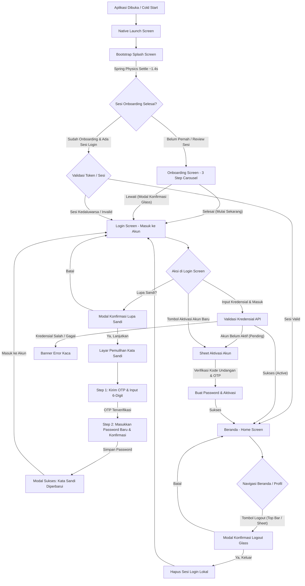

# Spesifikasi Alur Autentikasi, Onboarding, dan Sesi PALTI FX

## Status Dokumen

- **Status**: Disepakati & Diimplementasikan pada UI/UX Aplikasi (*Design & Flow Specification*).
- **Arsitektur Alur**: `Native Launch` → `Splash Screen` → `Onboarding Screen` → `Login Screen` → `Beranda (Home)`.
- **Karakteristik Akses**: Berbasis akun terkelola (*Invitation-Based / Admin Provisioned*). Tidak ada pendaftaran mandiri publik.
- **Pendekatan Desain**: *Dark Luxury Glassmorphism* (Obsidian Slate `#07090E`, Aksen Emas Bergradien, Frosted Glass Blur `expo-blur`, dan tipografi *Plus Jakarta Sans*).

---

## Gambaran Umum Alur (Flowchart)



---

## 1. Splash Screen & Startup Bootstrap

### 1.1 Peran dan Karakteristik
Splash Screen bertindak sebagai jembatan transisi visual dari saat sistem operasi pertama kali memuat runtime JavaScript hingga aset dan dependensi kritis selesai disiapkan.

### 1.2 Implementasi Desain & Animasi Aktual
- **Komponen**: `LogoMark` emas resmi ukuran besar (142px) di atas latar `colors.bg` (`#07090E`).
- **Animasi Fisika (*Spring Physics*)**:
  - Logo masuk dengan rotasi alami dari `-24deg` menuju `0deg`.
  - Skala membesar dari `0.68` menuju `1.0` menggunakan *natural spring deceleration* (`tension: 28`, `friction: 9`) tanpa easing artifisial.
- **Transisi Keluar (*Dissolve Exit*)**:
  - Setelah logo tenang (*settle* ~1.4 detik), logo larut keluar (*fade-out opacity* 380 ms) menuju layar Onboarding.
  - Native splash (`SplashScreen.hideAsync()`) ditutup secara sinkron saat runtime siap.

---

## 2. Onboarding Anggota (Pre-Login Experience)

### 2.1 Konsep & Penempatan
Layar Onboarding diletakkan sebelum Login Screen (**Splash → Onboarding → Login**) untuk memberikan pengenalan nilai dan orientasi visual kepada calon pengguna, anggota baru, serta kebutuhan peninjauan (*review*) klien sebelum masuk ke sistem autentikasi.

### 2.2 Anatomi Tampilan Onboarding
1. **Header**:
   - LogoMark (32px) + Wordmark PALTI FX di sisi kiri atas.
   - Tombol **"Lewati"** di kanan atas dengan latar kapsul semi-transparan (`rgba(255,255,255,0.06)`).
2. **Carousel Kartu Visual (3 Langkah)**:
   - **Langkah 1: Smart Trading Tools**
     - *Headline*: "Presisi Analisis dalam Genggaman"
     - *Subteks*: "Hitung ukuran lot ideal dan estimasi batasan risiko secara objektif sebelum membuka posisi agar modal akun tetap terlindungi."
     - *Visual*: Kartu live tools simulasi kalkulasi (Pip Value, Margin, Risk/Reward, dan persentase risiko).
   - **Langkah 2: Jurnal & Evaluasi Objektif**
     - *Headline*: "Catat, Analisis, dan Tingkatkan Rasio Profit"
     - *Subteks*: "Bangun konsistensi trading dengan evaluasi otomatis performa transaksi mingguan, win-rate, hingga kurva pertumbuhan akun."
     - *Visual*: Kartu performa metrik (Win Rate, Net Profit USD, status Profit Factor, dan diagram batang mingguan).
   - **Langkah 3: Kurikulum Terstruktur**
     - *Headline*: "Fondasi Kuat, Hasil Terukur"
     - *Subteks*: "Pelajari konsep teknikal dan manajemen risiko profesional langkah demi langkah lewat materi interaktif berjenjang."
     - *Visual*: Kartu modul kurikulum, badge level materi, dan indikator progres pembelajaran.
3. **Kontrol Navigasi Bawah**:
   - Indikator strip progres (3 garis halus dengan indikator aktif bergradien emas).
   - Tombol sekunder (*Langkah X dari 3* / tombol navigasi kembali).
   - Tombol aksi utama: Tombol emas bergradien (*"Lanjut"* untuk langkah 1-2, dan *"Mulai Sekarang"* pada langkah 3 yang langsung membawa pengguna ke Login Screen).

### 2.3 Modal Konfirmasi Lewati Onboarding
Jika pengguna menekan tombol **"Lewati"**, sistem tidak langsung memutus alur tanpa kejelasan, melainkan menampilkan Pop-up *Dark Glass* proporsional:
- **Card**: *Deep smoky dark glass* (`rgba(12, 16, 24, 0.88)`), radius 20, border halus `rgba(255,255,255,0.08)`.
- **Judul**: *"Lewati Pengenalan?"*
- **Deskripsi**: *"Kamu akan langsung diarahkan ke halaman login akun."*
- **Tombol Aksi**:
  - Tombol **Batal** (`colors.textDim`).
  - Tombol **Ya, Masuk** (Gradient emas `goldGradient`).

---

## 3. Login Screen ("Masuk ke Akun")

### 3.1 Anatomi Komponen & Estetika Visual
Layar Login dirancang dengan estetika *Obsidian Glassmorphism* yang elegan dan clean:

- **Brand Header**:
  - `LogoMark` emas ukuran 64px di atas ornamen lingkaran berlapis halus.
  - `Wordmark` emas PALTI FX dengan garis aksen tagline: `"PORTAL TRADER"`.
- **Glassmorphic Card (`BlurView`)**:
  - Seluruh form login berada di dalam kartu frosted glass (`intensity: 25-40`, `tint: dark`).
  - Latar semi-transparan `rgba(255,255,255,0.045)` dengan batas kilau atas (`borderTopColor: rgba(255,255,255,0.12)`).
  - Judul: *"Masuk ke Akun"*, Subjudul: *"Gunakan akun yang telah disiapkan admin"*.
- **Input Identifier**:
  - Label atas: `EMAIL ATAU USERNAME` (font semi-bold, uppercase, tracking proporsional).
  - Kotak input dengan ikon surat (`mail-outline`) di sisi kiri.
  - Tombol hapus cepat (*clear button X*) di sisi kanan saat input terisi.
- **Input Kata Sandi**:
  - Label atas dengan baris sejajar tautan *"Lupa sandi?"* berwarna emas.
  - Kotak input dengan ikon gembok (`lock-closed-outline`).
  - Toggle tampilkan/sembunyikan kata sandi (*eye / eye-off*) di sisi kanan.
- **Tombol Utama ("Masuk")**:
  - Full-width bergradien emas (`goldGradient`) dengan animasi scale saat ditekan (`PressScale`).
  - Keadaan *disabled* (opasitas 50%) bila field belum lengkap.
  - Keadaan *submitting* dengan spinner pemuat halus (`ActivityIndicator`) dan teks *"Memverifikasi..."*.
- **Pemisah & Tombol Aktivasi**:
  - Garis pembatas tipis dengan label tengah *"atau"*.
  - Tombol sekunder: *"Aktivasi Akun Baru"* untuk pengguna yang telah menerima undangan admin namun belum membuat kata sandi.

### 3.2 Alur Lupa Sandi dari Layar Login
1. Pengguna menekan tautan **"Lupa sandi?"**.
2. Muncul **Modal Pop-up Dark Glass** konfirmasi:
   - **Judul**: *"Lupa Kata Sandi?"*
   - **Deskripsi**: *"Atur ulang kata sandi dengan verifikasi kode OTP ke email terdaftar Anda. Lanjutkan ke pemulihan akun?"*
   - **Tombol**: *"Batal"* dan *"Ya, Lanjutkan"*.
3. Menekan *"Ya, Lanjutkan"* membawa pengguna ke **Layar Pemulihan Kata Sandi (ResetPasswordScreen)** dengan field email/username yang telah terisi otomatis jika sebelumnya sudah diketik di form login.

---

## 4. Pemulihan Kata Sandi & Modul OTP (ResetPasswordScreen)

Alur pemulihan kata sandi dirancang dalam 2 tahap (*stepper workflow*) yang terfokus:

```
[ Step 1: Kode OTP ]  ──►  [ Step 2: Sandi Baru ]  ──►  [ Pop-up Sukses ]
```

### 4.1 Stepper Indicator
Di atas kartu form terdapat indikator langkah horizontal yang clean:
- **Langkah 1**: Lingkaran angka `1` + Label *"Kode OTP"*.
- Garis penghubung minimalis.
- **Langkah 2**: Lingkaran angka `2` + Label *"Sandi Baru"*.

### 4.2 Step 1: Minta & Verifikasi Kode OTP
- **Field Email / Username**:
  - Input teks terintegrasi untuk memasukkan alamat email atau username akun yang akan dipulihkan.
- **Tombol Mandiri "Kirim Kode OTP" (`sendOtpFullBtn`)**:
  - Terletak tepat di bawah field email sebagai tombol aksi terpisah.
  - Dilengkapi ikon pesawat kertas (`paper-plane-outline`).
  - **Cooldown Timer 60 Detik**: Menampilkan hitung mundur otomatis (*"Kirim Ulang Kode OTP (59s)"*) setelah kode diminta untuk mencegah spamming request.
- **Field Kode OTP**:
  - Menggunakan tipografi input yang konsisten dan seragam dengan field aplikasi lainnya (`fonts.semi`, `fontSize: 13.5`, placeholder: *"Masukkan 6 digit kode OTP"*).
  - Tipe keyboard angka (`number-pad`), batas maksimal 6 digit.
  - Tidak ada teks / kotak tiruan demo yang mengganggu visual.
- **Tombol Lanjut**:
  - Tombol *"Verifikasi & Lanjutkan"* aktif ketika field email dan 6-digit OTP telah terisi.

### 4.3 Step 2: Buat Kata Sandi Baru & Konfirmasi
- **Field Kata Sandi Baru**:
  - Ikon gembok dan toggle visibilitas mata (*Show/Hide*).
- **Field Konfirmasi Kata Sandi Baru**:
  - Ikon gembok dan toggle visibilitas mata terpisah.
- **Checklist Persyaratan Real-Time**:
  - Menampilkan daftar checklist dinamis dengan ikon centang hijau jika terpenuhi:
    1. *Minimal 8 karakter*
    2. *Kata sandi cocok*
- **Tombol Simpan**:
  - *"Simpan Kata Sandi Baru"* dengan animasi pemuatan (*"Menyimpan..."*).

### 4.4 Pop-up Sukses Pembaruan Kata Sandi
Setelah kata sandi baru berhasil disimpan, antarmuka memunculkan Modal Pop-up *Dark Glass* yang selaras:
- **Container**: Smoky dark glass (`rgba(12, 16, 24, 0.90)`), radius 20, border tipis 0.08.
- **Tipografi Bersih (Tanpa Ikon Lingkaran Berlebih)**:
  - **Judul**: *"Kata Sandi Diperbarui"* (`fontSize: 16`, `fonts.semi`).
  - **Deskripsi**: *"Kata sandi Anda berhasil diperbarui. Silakan masuk kembali menggunakan kata sandi baru Anda."*
- **Tombol Konfirmasi**:
  - Tombol bergradien emas full-width: *"Masuk ke Akun"*.
  - Menekan tombol ini langsung menutup modal dan mengarahkan pengguna kembali ke **Layar Login**.

---

## 5. Aktivasi Akun Undangan

### 5.1 Alur Pengguna Baru Terundang
1. Pengguna membuka aplikasi melalui undangan admin atau memilih **"Aktivasi Akun Baru"** dari layar login.
2. Bottom Sheet Aktivasi muncul dengan input:
   - **Kode Undangan / Aktivasi** (format: misal `PLT-FX-XXXX`).
   - Tombol verifikasi undangan.
3. Setelah kode divalidasi oleh backend, pengguna diminta menetapkan kata sandi pertamanya.
4. Akun beralih dari status `pending_activation` menjadi `active`, sesi diterbitkan, dan pengguna diarahkan ke Beranda.

---

## 6. Sesi, Beranda, dan Logout

### 6.1 Beranda (Home Screen)
- Setelah terautentikasi (`isLoggedIn: true`), pengguna memiliki akses penuh ke fitur trading PALTI FX:
  - Header sapaan personal & tanggal aktif.
  - Ringkasan portofolio dan grafik ekuitas (*Equity Chart*).
  - Kalkulator trading cepat (*Quick Tools*).
  - Status modul edukasi.
  - Floating TabBar (*Beranda, Edukasi, Kalkulator, Jurnal*).

### 6.2 Alur Logout yang Benar & Aman
Logout dapat dipicu dari dua lokasi:
1. Tombol kapsul **Logout** di Top Bar kanan atas Beranda.
2. Tombol **Logout** di bagian bawah Profile Sheet pengguna.

**Ketentuan Perilaku Logout**:
1. **Modal Konfirmasi Dark Glass**:
   - Menghindari dialog browser native (`window.confirm` / `Alert.alert`).
   - Menampilkan modal pop-up seragam:
     - **Judul**: *"Keluar dari Akun?"*
     - **Deskripsi**: *"Anda akan keluar dari sesi ini dan kembali ke halaman login."*
     - **Tombol**: *"Batal"* dan *"Ya, Keluar"*.
2. **Pembersihan Sesi**:
   - Hanya menghapus status login (`isLoggedIn: false`) dan kredensial sesi lokal.
   - **Tidak menghapus status onboarding (`welcomed`)**: Pengguna yang pernah melewati/menyelesaikan onboarding tidak akan dipaksa mengulang onboarding saat logout.
3. **Pengalihan Layar**:
   - Pengguna keluar dari Beranda dan langsung berada di **Layar Login ("Masuk ke Akun")** secara mulus tanpa error.

---

## 7. Prinsip Keamanan & Normalisasi Input

1. **Normalisasi Data**:
   - **Email/Username**: Diterapkan `.trim().toLowerCase()` secara otomatis sebelum request API dikirim. Fitur *auto-capitalize* dan *auto-correct* dinonaktifkan pada TextInput.
   - **Kode OTP / Undangan**: Diterapkan `.trim().toUpperCase()` serta penghapusan karakter spasi/tanda hubung yang tidak disengaja dari clipboard.
   - **Kata Sandi**: Dikirim apa adanya tanpa pemotongan spasi untuk menjaga integritas passphrase.
2. **Penyimpanan Kredensial**:
   - Token sesi (*Access Token* & *Refresh Token*) disimpan pada media terenkripsi hardware native (`expo-secure-store`).
   - Data preferensi non-sensitif (riwayat kalkulator, status baca modul) disimpan pada storage lokal terpisah (`AsyncStorage`).
3. **Pemberitahuan Push**:
   - *Push Notification Token* didaftarkan saat login dan dihapus (*unregistered*) saat logout untuk mencegah kebocoran data transaksi di perangkat bersama.

---

## 8. Draf Kontrak API Backend

### 8.1 Login (`POST /api/v1/auth/login`)
**Request Body:**
```json
{
  "identifier": "trader@paltifx.com",
  "password": "PasswordAman123!",
  "device_id": "uuid-device-string",
  "platform": "ios"
}
```
**Response (200 OK):**
```json
{
  "access_token": "eyJhbGciOi...",
  "refresh_token": "dGhpcy1pcy1hLXJlZn...",
  "token_type": "Bearer",
  "expires_in": 900,
  "user": {
    "id": "usr_102938",
    "email": "trader@paltifx.com",
    "name": "Member Trader",
    "status": "active"
  }
}
```

### 8.2 Kirim OTP Pemulihan (`POST /api/v1/auth/forgot-password/send-otp`)
**Request Body:**
```json
{
  "identifier": "trader@paltifx.com"
}
```
**Response (200 OK):**
```json
{
  "status": "success",
  "message": "Kode OTP telah dikirimkan ke email terdaftar",
  "cooldown_seconds": 60
}
```

### 8.3 Verifikasi OTP & Reset Password (`POST /api/v1/auth/forgot-password/verify-reset`)
**Request Body:**
```json
{
  "identifier": "trader@paltifx.com",
  "otp": "123456",
  "new_password": "PasswordBaru123!"
}
```
**Response (200 OK):**
```json
{
  "status": "success",
  "message": "Kata sandi Anda telah berhasil diperbarui"
}
```

### 8.4 Aktivasi Akun Undangan (`POST /api/v1/auth/activate`)
**Request Body:**
```json
{
  "activation_code": "PLT-FX-9921",
  "password": "PasswordBaru123!"
}
```
**Response (200 OK):**
```json
{
  "access_token": "eyJhbGciOi...",
  "refresh_token": "dGhpcy1pcy1hLXJlZn...",
  "user": {
    "id": "usr_102938",
    "email": "trader@paltifx.com",
    "status": "active"
  }
}
```

### 8.5 Logout (`POST /api/v1/auth/logout`)
**Request Body:**
```json
{
  "refresh_token": "dGhpcy1pcy1hLXJlZn..."
}
```
**Response (200 OK):**
```json
{
  "status": "logged_out"
}
```
